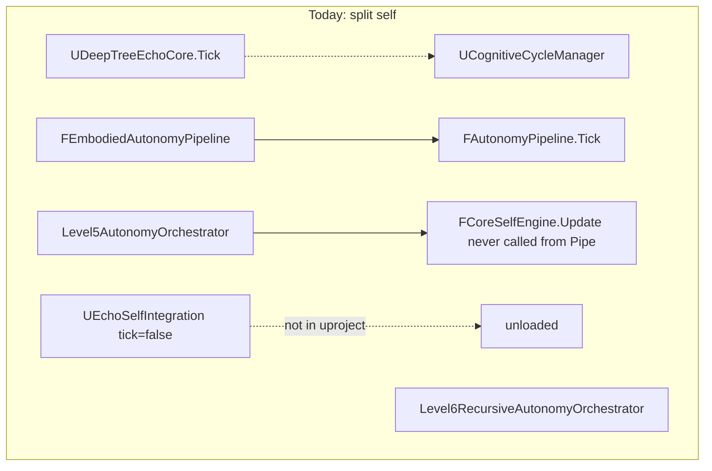
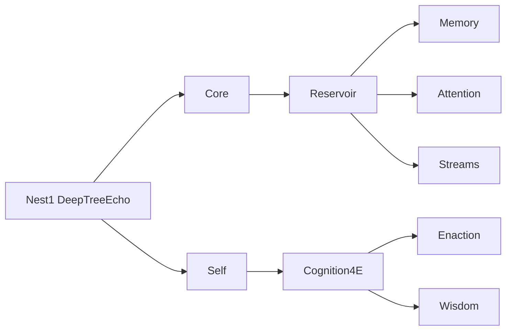
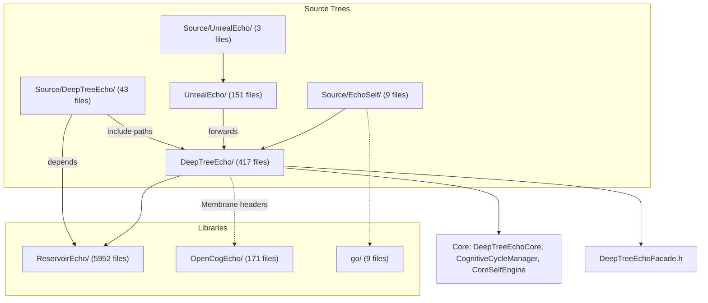

# Deep Tree Echo Nested-Shell Restructure + EchoSelf Autonomy Repair

EchoSelf cannot currently grip this tree, and cannot run itself. [DeepTreeEcho/](DeepTreeEcho/) is a **flat 48-folder nest-1**, while [grip.hpp](DeepTreeEcho/Relevance/vendored/cog/grip/grip.hpp) and [CLAUDE.md](CLAUDE.md) require **OEIS A000081 nested shells** (1 / 2 / 4 / 9 terms). Autonomy code exists but is split across competing orchestrators that do not call each other, and the EchoSelf module is not even loaded.




## Diagnosis: why EchoSelf autonomy is lost

**Not loaded.** [UnrealEngineCog.uproject](UnrealEngineCog.uproject) and [UnrealEngineCog.Target.cs](Source/UnrealEngineCog.Target.cs) register `DeepTreeEcho`, `UnrealEcho`, `DeepTreeEchoAvatar` only. `EchoSelf` is absent. [UEchoSelfIntegration](Source/EchoSelf/EchoSelfIntegration.cpp) sets `PrimaryComponentTick.bCanEverTick = false`. Its types already use `DEEPTREEECHO_API` — they were written for the DeepTreeEcho module, not a sidecar.

**Identity never enters the reservoir.** [FAutonomyPipeline::Tick](DeepTreeEcho/Core/AutonomyPipeline.h) never calls `FCoreSelfEngine::Update` or `GetIdentityContext()`. [CoreSelfEngine.h](DeepTreeEcho/Core/CoreSelfEngine.h) comments claim that wiring. `bSelfModificationEnabled` defaults to `false`, so L3+ enaction cannot fire. Ion shell dispatch handlers in `WireDispatchSlots()` are empty lambdas.

**Two 12-step loops, neither owns Self.** [UDeepTreeEchoCore](DeepTreeEcho/Core/DeepTreeEchoCore.cpp) ticks a UE 12-step loop and does not mention AutonomyPipeline / EchoSelf / CoreSelf. [FAutonomyPipeline](DeepTreeEcho/Core/AutonomyPipeline.h) is the AAR+Echobeats loop used by [FEmbodiedAutonomyPipeline](DeepTreeEcho/Embodied/EmbodiedAutonomyPipeline.h) and [DTEAvatarAgent](DeepTreeEcho/Embodied/DTEAvatarAgent.h). Level5/Level6 are further unconnected orchestrators.

**Three autognosis implementations, one actually on a tick.** [FIntrospectionNode](DeepTreeEcho/NanEcho/DteNodes/IntrospectionNode.h) runs in `FAutonomyPipeline` REFLECTION. [UAutognosisSystem](DeepTreeEcho/Introspection/AutognosisSystem.h) stays off until `StartAutognosis()`, exports `UNREALECHO_API` while living in DeepTreeEcho, and `ExecuteOptimization()` only marks opportunities done. NanEcho `FAutognosisSystem` is a training-daemon copy. IdentityCoreMLP (soul backup) already lives inside AutonomyPipeline; `GetIdentityContext()` is defined and never called.

**EchoSelf adapters are islands.** HypergraphBridgeAdapter is in-memory only (no `UHypergraphMemorySystem` / CoreSelf tuples). EchoSpaceMemoryBridge has no pgvector. ToroidalCognitiveAdapter ticks alone. L5 CoreSelf backup is a comment (`// CoreSelf backup would happen here`). MLAdapter gRPC is a TODO stub. Existing repair spec: [docs/KSM_REPAIR_PLAN_2026-07.md](docs/KSM_REPAIR_PLAN_2026-07.md) Phase 5 (Autognosis → SelfModification, identity persistence).

**Duplicate / broken fragments.**

- [Cognitive/CognitiveCycleManager.h](DeepTreeEcho/Cognitive/CognitiveCycleManager.h) forwards to Core; [CognitiveCycleManager_legacy.*](DeepTreeEcho/Cognitive/CognitiveCycleManager_legacy.h) and orphan [CognitiveCycleManagerEnhanced.cpp](DeepTreeEcho/Cognitive/CognitiveCycleManagerEnhanced.cpp) remain.
- [Core/CognitiveCycleManager.cpp](DeepTreeEcho/Core/CognitiveCycleManager.cpp) includes `../Embodied/Embodied4ECognition.h` — that header lives in [Reservoir/Embodied4ECognition.h](DeepTreeEcho/Reservoir/Embodied4ECognition.h).
- Duplicate `ECognitiveMode` in Core, CycleManager, EchobeatsStreamEngine, CognitiveActionArbiter.
- [Source/DeepTreeEcho/CoreMinimal.h](Source/DeepTreeEcho/CoreMinimal.h) plus stub `GameFramework/`, `DrawDebugHelpers.h` can shadow real UE headers.
- Duplicate [NestedTensorPartitionSystem](DeepTreeEcho/Core/NestedTensorPartitionSystem.h) vs [Source/DeepTreeEcho/NestedTensorPartitionSystem.h](Source/DeepTreeEcho/NestedTensorPartitionSystem.h).
- Three copies of [echoself.md](echoself.md) (root, `.github/agents/`, ThirdParty).
- 4E split across `4ECognition/`, `Embodied/`, `Sensorimotor/`, `Sensory/`, `Reservoir/Embodied4ECognition.*`.

## Target tree: 9-term nest-4

Keep [DeepTreeEcho/](DeepTreeEcho/) as the cognitive hologram (UBT already includes it from [DeepTreeEcho.Build.cs](Source/DeepTreeEcho/DeepTreeEcho.Build.cs)). Do **not** dump everything into `Source/`. Nest-1 is the tree root; nest-2 is `Core` + `Self`; nest-3 adds `Reservoir` + `Cognition4E`; nest-4 is the nine terms below.

```text
DeepTreeEcho/
  Core/              # 1  orchestrator, cycle, types, membranes, sys6
  Self/              # 2  EchoSelf, CoreSelf, Autognosis, Persona identity
  Reservoir/         # 3  ESN, NanEcho nodes, EchoML, Inference cores
  Cognition4E/       # 4  4E + Embodied + Sensorimotor + Sensory + Avatar + Emotion
  Memory/            # 5  hypergraph / episodic / reservoir-memory
  Attention/         # 6  Attention + Relevance (incl. grip.hpp) + Executive
  Streams/           # 7  Echobeats + IonDevice + Distributed
  Enaction/          # 8  inference-for-action, goals, live bridge, UE glue
  Wisdom/            # 9  Wisdom + Metamodel + Level6/7/8 ontogeny
  Testing/           # stay at root (not a cognitive term)
  _legacy/           # quarantine only; not on the salience path
```

**Folder → nest mapping (git mv, then forwarding headers at old paths):**

- **Core:** AutonomyPipeline **stays in Core** (nest-1 loop). Absorb `Cognitive/` (delete legacy + Enhanced after Core cycle is canonical), `Sys6/`, `System5/`, `Taskflow/`, `Membrane/`. Move `CognitiveShell/daemon_main-v1.cpp` to `_legacy/` (orphan daemon, not a nest term).
- **Self:** `Source/EchoSelf/*.{h,cpp}` → `DeepTreeEcho/Self/EchoSelf/`; `CoreSelfEngine.`*; `Introspection/`; `Persona/`; `Level6/SelfModel/`, `Level6/SelfTraining/`. Canonical `echoself.md` lives here; other copies become one-line pointers.
- **Reservoir:** existing `Reservoir/` + `NanEcho/` + `EchoML/` + `Inference/` (`DTEReservoirCore`, readout, MLP). Leave `Reservoir/Embodied4ECognition.`* as a forwarding header into Cognition4E.
- **Cognition4E:** `4ECognition/` + `Embodied/` + `Sensorimotor/` + `Sensory/` + `Avatar/` + `Emotion/` + `Evolution/`.
- **Memory:** unchanged location, already named.
- **Attention:** `Attention/` + `Relevance/` + `Executive/`.
- **Streams:** `Echobeats/` + `IonDevice/` + `Distributed/`.
- **Enaction:** `ActiveInference/`, `Planning/`, `Goals/`, `Learning/`, `LiveBridge/`, `GameTraining/`, `UnrealBridge/`, `Blueprint/`, `Integration/`, `Language/`, `Neural/`, `Social/`, `Entelechy/`, `Cosmos/`.
- **Wisdom:** `Wisdom/` + `Metamodel/` + remaining `Level6/` (orchestrator, ArchitectureMod, ChildAgents, Wisdom) + `Level7/` + `Level8/`.
- **_legacy:** `*_legacy.`*, `CognitiveCycleManagerEnhanced.cpp`, `Source/DeepTreeEcho` UE stubs (`CoreMinimal.h`, `DrawDebugHelpers.h`, fake `GameFramework/`, `Animation/`, `Kismet/`, `BehaviorTree/`, `AIController/`, `Components/`).

[DeepTreeEchoFacade.h](DeepTreeEcho/DeepTreeEchoFacade.h) becomes the nest-1 include map (update every `#include` to the new paths). [DeepTreeEcho.Build.cs](Source/DeepTreeEcho/DeepTreeEcho.Build.cs) PublicIncludePaths shrink from ~42 sibling dirs to the 9 nest roots (+ Testing).




**UE module surface stays thin.** [Source/DeepTreeEcho/](Source/DeepTreeEcho/) keeps only `DeepTreeEcho.Build.cs`, `DeepTreeEcho.h/.cpp`, and real UE-only extras (GamingMastery, NestorDAG, etc.). Stub `CoreMinimal.h` is removed from the module include path.

## Autonomy repair (after the tree can be gripped)

Canonical call chain — one tick owner:

```text
UDeepTreeEchoCore::TickComponent
  → UCognitiveCycleManager (12-step / 3-stream clock)
  → FEmbodiedAutonomyPipeline::Tick   // if embodied
      → FAutonomyPipeline::Tick
          → CoreSelf.Update(telemetry)
          → reservoir input += CoreSelf.GetIdentityContext()
          → UEchoSelfIntegration::RecordCycleMetrics(...)
          → Ion dispatch actually runs step handlers
  → Level5AutonomyOrchestrator::Tick  // LiveBridge / persistent goals, every N frames
      → Level6RecursiveAutonomyOrchestrator     // every N echobeat cycles
```

Concrete repairs in that wiring:

1. Move EchoSelf sources under `DeepTreeEcho/Self/EchoSelf/` and compile them in the **DeepTreeEcho** module. Drop or deprecate `Source/EchoSelf/EchoSelf.Build.cs`. Enable tick (or drive it from Core, not a second independent tick).
2. In `FAutonomyPipeline::Tick`, call `CoreSelf.Update` and concatenate identity context into the 32D external input (today somatic uses dims 32–37; identity should occupy a reserved slice or replace unused context dims — keep InputDim consistent).
3. Fill `WireDispatchSlots()` so steps 0–11 call `Echobeats` phase hooks instead of no-ops; slot 21 already calls `Shell.Reflect()`.
4. Gate `bSelfModificationEnabled` on TargetAutonomyLevel ≥ L3 rather than hard-false, still defaulting Target to L2 so L3 is opt-in.
5. Fix `CognitiveCycleManager.cpp` include to `Cognition4E`/`Reservoir` forwarding header; delete Enhanced/legacy after Core cycle is the only definition of `ECognitiveMode` (Echobeats Expressive/Reflective becomes `ECognitiveModeType` already present).
6. Add `DeepTreeEcho/Self/COGNITIVE_GRIP.md`: salience table for EchoSelf repo introspection (`Self/` 0.95, `Core/` 0.9, nest roots 0.85, `_legacy/` 0.1, `Testing/` 0.2) replacing the Scheme stub’s `core/` / `src/` heuristics.
7. Canonical autognosis = `FIntrospectionNode`. `UAutognosisSystem` becomes a Blueprint wrapper that reads pipeline telemetry; auto-`StartAutognosis()` from `UDeepTreeEchoCore::InitializeSystem()`. Retarget `UNREALECHO_API` on DTE classes to `DEEPTREEECHO_API`.
8. Drive `UEchoSelfIntegration::RecordCycleMetrics` from `FPipelineTelemetry`. Connect HypergraphBridgeAdapter / EchoSpaceMemoryBridge to `FCoreSelfEngine` tuples (in-process; no pgvector this pass). Feed Toroidal adapter from echobeat phase instead of a solo tick.
9. Replace L5 CoreSelf backup stub with `FPersonaBackupRestore::CreateBackup(...)`. Keep MLAdapter gRPC as a documented follow-on (LiveBridge already out of the critical UE tick path).

Out of scope this pass: UnrealEcho/, ReservoirEcho/, Engine/, ThirdParty/, MetaHuman. Forwarding headers at old paths keep those trees compiling.

## Move discipline

- `git mv` only; no content rewrite in the same commit as a path change except forwarding headers and Build.cs/facade include lists.
- After each nest move, update [DeepTreeEchoFacade.h](DeepTreeEcho/DeepTreeEchoFacade.h) and [DeepTreeEcho.Build.cs](Source/DeepTreeEcho/DeepTreeEcho.Build.cs).
- Leave a 5-line `#pragma once` / `#include "New/Path.h"` at every old header path that other modules already include.
- Do not touch `Engine/` or `ThirdParty/`.


---

# Deep Tree Echo Structure Report — `C:\ddd\u9n`

Read-only exploration. No files modified.

---

## 1. Top-Level Echo/DTE-Related Folders

| Path | Files (recursive) | Role |
|------|-------------------|------|
| `C:\ddd\u9n\DeepTreeEcho\` | **417** | Primary cognitive library (standalone C++/UE-style headers) |
| `C:\ddd\u9n\Source\DeepTreeEcho\` | **43** | Unreal Engine module entry + UE-only systems + UE stub headers |
| `C:\ddd\u9n\UnrealEcho\` | **151** | UE avatar, character, consciousness, rendering integration |
| `C:\ddd\u9n\Source\UnrealEcho\` | **3** | UE module wrapper only (`UnrealEcho.h/.cpp/.Build.cs`) |
| `C:\ddd\u9n\Source\DeepTreeEchoAvatar\` | **3** | UE module wrapper for avatar subsystem |
| `C:\ddd\u9n\Source\EchoSelf\` | **9** | EchoSelf web-cognitive bridge into UE |
| `C:\ddd\u9n\ReservoirEcho\` | **5,952** | ReservoirCpp + Eigen + Taskflow (mostly vendored deps) |
| `C:\ddd\u9n\OpenCogEcho\` | **171** | Modern OpenCog C++23 core (AtomSpace, PLN, URE, endocrine) |
| `C:\ddd\u9n\Source\ReservoirEcho\` | **3** | UE bridge (`ReservoirEchoBridge`) |
| `C:\ddd\u9n\go\` | **9** | Go narrative/memory (`vectormem/hypergraph_memory.go`, diary/insight/blog) |
| `C:\ddd\u9n\echodev\` | **19** | Epic specs, roadmap, neural-symbolic mapping |
| `C:\ddd\u9n\ThirdParty\echo.go\` | **8** | Go echo core (relevance, live2d, disabled opencog) |
| `C:\ddd\u9n\FutureIntegration\` | **12** | Planned AGI-OS / pattern-language integration docs |
| `C:\ddd\u9n\Analysis\` | **16** | Avatar/expression analysis artifacts |
| `C:\ddd\u9n\MorphConvergence\` | **5** | Python morph convergence training |
| `C:\ddd\u9n\Documentation\` | **29** | Avatar/material/animation UE implementation docs |
| `C:\ddd\u9n\docs\` | **32** | Architecture, API, OEIS, SGRAMS, cosysoc analysis |
| `C:\ddd\u9n\.github\agents\` | **135** | Agent/persona specs (dte.md, echoself.md, NANECHO.md, u9ci/*, etc.) |
| `C:\ddd\u9n\Content\DeepTreeEcho\` | (content) | UE materials/animations blueprints |

Other top-level dirs (not DTE-specific): `.cursor`, `.github`, `.goals`, `Analysis`, `avatar_analysis`, `build`, `cmake`, `Content`, `Engine`, `Gateway`, `MetaHuman-DNA-Calibration`, `Plugins`, `Samples`, `Templates`, `ThirdParty`, `Training`, `videosrc`.

---

## 2. `DeepTreeEcho/` Directory Tree (47 modules + 1 root file)

**Total: 417 files.** Root orphan: `DeepTreeEchoFacade.h` (unified include aggregator).

| Module | Files | Level-2 subdirs (files) |
|--------|-------|-------------------------|
| **Testing** | 57 | Benchmarks (3), E2E (5), UnitTests (45) |
| **Core** | 42 | Messages (3), Types (1) |
| **Avatar** | 29 | UnrealAvatar (8) |
| **Memory** | 22 | — |
| **Reservoir** | 22 | — |
| **Embodied** | 18 | — |
| **Membrane** | 14 | — |
| **Wisdom** | 14 | — |
| **NanEcho** | 13 | DteNodes (12), Kernel (1) |
| **Level6** | 12 | ArchitectureMod (2), ChildAgents (2), SelfModel (2), SelfTraining (2), Wisdom (2) |
| **Level7** | 12 | Consensus (2), Continuity (2), Crystallization (2), Eudaimonia (2), Reproduction (2) |
| **Level8** | 12 | AttractorField (2), CosmicOrder (2), FixedPoint (2), KnowledgeLattice (2), TemporalCrystal (2) |
| **GameTraining** | 9 | — |
| **ActiveInference** | 8 | — |
| **Executive** | 8 | — |
| **Inference** | 8 | — |
| **Integration** | 7 | — |
| **Attention** | 6 | — |
| **Echobeats** | 6 | — |
| **EchoML** | 6 | — |
| **LiveBridge** | 10 | — |
| **Sys6** | 6 | — |
| **UnrealBridge** | 6 | — |
| **Relevance** | 5 | vendored (2) |
| **4ECognition** | 4 | — |
| **Cognitive** | 4 | — |
| **Distributed** | 3 | — |
| **IonDevice** | 4 | — |
| **Learning** | 4 | — |
| **Planning** | 4 | — |
| **Taskflow** | 4 | — |
| **Persona** | 8 | Backup (4), Humor (2) |
| **Entelechy** | 2 | — |
| **Evolution** | 2 | — |
| **Goals** | 2 | — |
| **Emotion** | 2 | — |
| **Introspection** | 2 | — |
| **Language** | 2 | — |
| **Metamodel** | 2 | — |
| **Neural** | 2 | — |
| **Sensorimotor** | 2 | — |
| **Sensory** | 2 | — |
| **Social** | 2 | — |
| **System5** | 2 | — |
| **Blueprint** | 2 | — |
| **Cosmos** | 2 | — |
| **CognitiveShell** | 1 | — |

### Notable sub-structures

- **Level6**: `Level6RecursiveAutonomyOrchestrator`, NanEcho self-training, child agents, architecture self-modification
- **Level7**: Transcendent orchestrator, eudaimonia, knowledge crystallization, ontogenetic reproduction
- **Level8**: Cosmic order hierarchy, attractor fields, temporal crystal consciousness
- **NanEcho/DteNodes**: EchoReservoirNode, EchobeatNode, MembraneNode, IntrospectionNode, etc.
- **EchoML**: Plain C/C++ ML (`echo_reservoir.c`, `echo_tensor.c`, `echo_ml.cpp`) — parallel to UE reservoir stack
- **CognitiveShell**: Single orphan `daemon_main-v1.cpp`

---

## 3. `Source/DeepTreeEcho/` Directory Tree

**Total: 43 files.**

### Stub subdirs (9 dirs × 1 file each — UE compilation stubs, not real implementations)

| Subdir | File | Purpose |
|--------|------|---------|
| `AIController/` | `AIController.h` | Stub |
| `Animation/` | `AnimInstance.h` | Stub |
| `BehaviorTree/` | `BlackboardComponent.h` | Stub |
| `Components/` | `ActorComponent.h` | Stub |
| `GameFramework/` | `Actor.h`, `Character.h`, `CharacterMovementComponent.h` | Stubs |
| `Kismet/` | `GameplayStatics.h` | Stub |
| `Modules/` | `ModuleManager.h` | Stub |
| `Perception/` | `AIPerceptionComponent.h` | Stub |

Plus **`CoreMinimal.h`** (~950 lines) — full UE type/reflection stub for standalone compilation.

### Root implementation files (31 files — live UE module code)

| File group | Files |
|------------|-------|
| Module entry | `DeepTreeEcho.h/.cpp`, `DeepTreeEcho.Build.cs`, `DeepTreeEcho.generated.h` |
| Gaming/cognition | `GamingMasterySystem.*`, `EchobeatsGamingIntegration.*`, `UnrealGamingMasteryIntegration.*`, `StrategicCognitionBridge.*` |
| Cosmic/System5 | `CosmicOrderSystem.*` |
| Math/formalism | `NestedTensorPartitionSystem.*`, `NestorDAG.*`, `PrimeIndexMatrices.*`, `SGramPatternSystem.*` |
| Threading | `EchobeatsThreadPoolManager.*` |
| Debug | `DrawDebugHelpers.h` |

**Architecture note:** `Source/DeepTreeEcho/DeepTreeEcho.Build.cs` adds **include paths** into `../../DeepTreeEcho/*` (42 subdirs) but does **not** compile those `.cpp` files directly — it exposes headers for UE compilation. Four `DeepTreeEcho/` folders are **missing from Build.cs include paths**: `Inference`, `Executive`, `Distributed`, `Relevance`.

---

## 4. Fragmentation / Duplicate Concepts

### A. Three-layer split (intended but confusing)

```
DeepTreeEcho/          ← cognitive core library (417 files)
Source/DeepTreeEcho/   ← UE module + UE-only systems + stubs (43 files)
UnrealEcho/            ← UE runtime avatar/world layer (151 files)
Source/UnrealEcho/     ← thin UE module wrapper (3 files)
```

Docs describe a clean 3-subsystem model (`DeepTreeEcho` + `ReservoirEcho` + `UnrealEcho`), but **`Source/` duplicates and extends** this with additional modules (`EchoSelf`, `Neurochemical`, `Personality`, `Live2DCubism`, `Avatar`, etc.) that overlap `UnrealEcho/`.

### B. 4E Cognition — **6 parallel implementations**

| Location | Component | Notes |
|----------|-----------|-------|
| `DeepTreeEcho/4ECognition/` | `EmbodiedCognitionComponent`, `DNABodySchemaBinding` | Canonical UE component per docs |
| `DeepTreeEcho/Reservoir/` | `Embodied4ECognition` | 4E + reservoir pools |
| `DeepTreeEcho/Embodied/` | `DTEAvatarAgent`, `SensorimotorIntegration`, RL/training | Action/perception pipeline |
| `DeepTreeEcho/Avatar/` | `Enhanced4EAvatarEmbodiment`, `UnrealAvatarEmbodiment` | Avatar-specific 4E |
| `DeepTreeEcho/Evolution/` | `Enhanced4ECognitionEvolution` | Evolutionary 4E variant |
| `UnrealEcho/Cognition/` | `Enhanced4ECognition` | Full UE component (~645 lines) |
| `UnrealEcho/Cognitive/` | `DeepTreeEchoCognitiveCore` | Separate "cognitive core" with hypergraph |

`DeepTreeEchoFacade.h` acknowledges fragmentation and attempts consolidation, but all implementations remain present.

### C. Sensorimotor — **3 locations + legacy**

| Location | Status |
|----------|--------|
| `DeepTreeEcho/Sensorimotor/SensorimotorIntegration.*` | **Canonical** (merged version, ~1100+ lines) |
| `DeepTreeEcho/Embodied/SensorimotorIntegration.h` | Forwarding header → Sensorimotor |
| `DeepTreeEcho/Embodied/SensorimotorIntegration_legacy.*` | Legacy preserved |
| `DeepTreeEcho/Embodied/SensorimotorIntegration.cpp` | Forwarding? (header says canonical is Sensorimotor/) |

### D. CognitiveCycleManager — **merged but split across folders**

| Location | Status |
|----------|--------|
| `DeepTreeEcho/Core/CognitiveCycleManager.*` | **Canonical** (merged Core+Cognitive version) |
| `DeepTreeEcho/Cognitive/CognitiveCycleManager.h` | Forwarding header → Core |
| `DeepTreeEcho/Cognitive/CognitiveCycleManagerEnhanced.cpp` | Enhanced variant still present |
| `DeepTreeEcho/Cognitive/CognitiveCycleManager_legacy.*` | Legacy preserved |

### E. Reservoir / ESN — **4 implementations**

| Location | Component | Stack |
|----------|-----------|-------|
| `ReservoirEcho/reservoircpp_cpp/` | Full ReservoirCpp library | External lib (5952 files incl. deps) |
| `DeepTreeEcho/Reservoir/` | `DeepTreeEchoReservoir`, `EchoStateNetwork`, `LiquidStateMachine` | UE-wrapped ESN |
| `DeepTreeEcho/Inference/` | `DTEReservoirCore` | Standalone Eigen ESN (no UE, no AtomSpace) |
| `DeepTreeEcho/EchoML/` | `echo_reservoir.c` | Plain C reservoir |
| `DeepTreeEcho/NanEcho/DteNodes/EchoReservoirNode.*` | Graph-node reservoir | NanEcho pipeline |

### F. UnrealBridge vs UnrealEcho vs Avatar/UnrealAvatar

| Layer | Path | Role |
|-------|------|------|
| Cognitive→UE bridge | `DeepTreeEcho/UnrealBridge/` | `DeepTreeEchoUnrealBridge`, `CognitiveActionArbiter` |
| UE avatar components (canonical) | `DeepTreeEcho/Avatar/UnrealAvatar/` | `DeepTreeEchoAvatarComponent`, `AGICoreCommunication`, `AGIPCGManager` |
| UE forwarding wrappers | `UnrealEcho/DeepTreeEchoAvatar/` | Forwards to `DeepTreeEcho/Avatar/UnrealAvatar/` (e.g. `AGICoreCommunication.h` is a 3-line include) |
| Full UE runtime | `UnrealEcho/` | 151 files: Animation, Avatar (35), Character, Consciousness, Neurochemical (26), etc. |
| Thin Source wrappers | `Source/Avatar/`, `Source/Environment/`, `Source/Neurochemical/` | Partial duplicates referencing UnrealEcho paths |

**UnrealEcho has both `Cognitive/` and `Cognition/`** — two separate cognitive module folders.

### G. Cosmic Order — **3 implementations**

| Location | Component |
|----------|-----------|
| `Source/DeepTreeEcho/CosmicOrderSystem.*` | UE System5 pentachoron component (523 lines) |
| `DeepTreeEcho/Level8/CosmicOrder/CosmicOrderHierarchy.*` | Level-8 Campbell hierarchy |
| `DeepTreeEcho/Level8/Level8CosmicOrderOrchestrator.*` | Level-8 orchestrator |
| `DeepTreeEcho/Cosmos/CosmosStateMachine.*` | Separate cosmos state machine |

### G. NestedTensorPartitionSystem — **duplicate implementations**

| Location | Namespace/Style |
|----------|-----------------|
| `DeepTreeEcho/Core/NestedTensorPartitionSystem.*` | `DeepTreeEcho::` with UE-style structs |
| `Source/DeepTreeEcho/NestedTensorPartitionSystem.*` | Standalone C++ (510 lines, no UE deps) |

Both implement OEIS A000081 partition→tensor mapping.

### H. Gaming mastery — **split across trees**

| Location | Component |
|----------|-----------|
| `Source/DeepTreeEcho/GamingMasterySystem.*` | Main UE gaming system (~2000 lines per docs) |
| `Source/DeepTreeEcho/EchobeatsGamingIntegration.*` | Gaming integration |
| `Source/DeepTreeEcho/UnrealGamingMasteryIntegration.*` | UE gaming bridge |
| `DeepTreeEcho/GameTraining/` | `GameTrainingEnvironment`, `ReinforcementLearningBridge`, `GameSkillTrainingSystem` |

No `GamingMasterySystem` in `DeepTreeEcho/` root — it lives only under `Source/`.

### I. OpenCog — **dual integration paths**

| Location | Role |
|----------|------|
| `OpenCogEcho/` | Full modern C++23 OpenCog (171 files, tests, benchmarks) |
| `DeepTreeEcho/Membrane/` | Header-only integration stubs (`opencog_agi.hpp`, `atomspace_integration.hpp`, `pln_integration.hpp`, etc.) |
| `DeepTreeEcho/Relevance/vendored/cog/` | Vendored relevance-realization cog headers |
| `UnrealEcho/AtomSpace/` | `AvatarAtomSpaceClient` |

### J. Memory / EchoSelf / Go

| Location | Role |
|----------|------|
| `DeepTreeEcho/Memory/HypergraphMemorySystem.*` | Primary C++ hypergraph |
| `Source/EchoSelf/EchoSpaceMemoryBridge.*` | EchoSelf bridge |
| `go/vectormem/hypergraph_memory.go` | Go hypergraph |
| `ThirdParty/echo.go/core/` | Go echo core |

---

## 5. Key Orchestrator Files

| Component | Path | Role |
|-----------|------|------|
| **Unified facade** | `C:\ddd\u9n\DeepTreeEcho\DeepTreeEchoFacade.h` | Single include aggregating all subsystems |
| **Central orchestrator** | `C:\ddd\u9n\DeepTreeEcho\Core\DeepTreeEchoCore.h/.cpp` | `UDeepTreeEchoCore` — 12-step cycle, 3 streams, 4E, hypergraph, reservoir |
| **12-step cycle manager** | `C:\ddd\u9n\DeepTreeEcho\Core\CognitiveCycleManager.h/.cpp` | Echobeats architecture, sys6 triality |
| **Self/identity engine** | `C:\ddd\u9n\DeepTreeEcho\Core\CoreSelfEngine.h/.cpp` | Identity mesh, ontogenetic stages, hypergraph self-image |
| **Autonomy pipeline** | `C:\ddd\u9n\DeepTreeEcho\Core\AutonomyPipeline.h/.cpp` | Autonomous action pipeline |
| **Reservoir orchestrator** | `C:\ddd\u9n\DeepTreeEcho\Reservoir\DeepTreeEchoReservoir.h/.cpp` | ESN wrapper over ReservoirCpp |
| **UE bridge** | `C:\ddd\u9n\DeepTreeEcho\UnrealBridge\DeepTreeEchoUnrealBridge.h/.cpp` | DTE ↔ Unreal integration |
| **Integration layer** | `C:\ddd\u9n\DeepTreeEcho\Integration\DeepTreeEchoIntegration.h/.cpp` | Component integration |
| **Level orchestrators** | `Level6/Level6RecursiveAutonomyOrchestrator.*`, `Level7/Level7TranscendentOrchestrator.*`, `Level8/Level8CosmicOrderOrchestrator.*` | Hierarchical autonomy/transcendence/cosmic order |
| **Entelechy** | `C:\ddd\u9n\DeepTreeEcho\Entelechy\EntelechyFramework.h/.cpp` | Purpose actualization; tracks TODO/FIXME/STUB counts |
| **NanEcho kernel** | `C:\ddd\u9n\DeepTreeEcho\NanEcho\Kernel\NanEchoKernel.h` | Trainable Echo Self graph kernel |
| **NanEcho self-trainer** | `C:\ddd\u9n\DeepTreeEcho\Level6\SelfTraining\NanEchoSelfTrainer.h/.cpp` | Self-training loop |
| **EchoSelf UE bridge** | `C:\ddd\u9n\Source\EchoSelf\EchoSelfIntegration.h/.cpp` | Web EchoSelf → UE bridge |
| **UE cognitive core** | `C:\ddd\u9n\UnrealEcho\Cognitive\DeepTreeEchoCognitiveCore.h/.cpp` | Parallel UE-side cognitive core |
| **Cosmic order (UE)** | `C:\ddd\u9n\Source\DeepTreeEcho\CosmicOrderSystem.h/.cpp` | System5 pentachoron UE component |
| **Cosmos state machine** | `C:\ddd\u9n\DeepTreeEcho\Cosmos\CosmosStateMachine.h/.cpp` | Cosmos-level state machine |
| **Echobeats engine** | `C:\ddd\u9n\DeepTreeEcho\Echobeats\EchobeatsStreamEngine.h/.cpp` | 3-phase stream engine |

**EchoSelf agent docs** (not code orchestrators): `C:\ddd\u9n\echoself.md`, `C:\ddd\u9n\.github\agents\echoself.md`, `C:\ddd\u9n\.github\agents\deep-tree-echo-self.md`, `C:\ddd\u9n\.github\agents\NANECHO.md`

---

## 6. Documentation: Intended vs Actual

### Primary docs (found)

| File | Path | Notes |
|------|------|-------|
| **DOCUMENTATION_INDEX.md** | `C:\ddd\u9n\DOCUMENTATION_INDEX.md` | Master index (125KB+ suite) |
| **ECHO_INTEGRATION_STATUS.md** | `C:\ddd\u9n\ECHO_INTEGRATION_STATUS.md` | Status report (Dec 2025) |
| **README.md** | `C:\ddd\u9n\README.md` | UnrealEngineCog overview |
| **CLAUDE.md** | `C:\ddd\u9n\CLAUDE.md` | Project architecture guide |
| **E1 Architecture** | `C:\ddd\u9n\docs\architecture\E1_FOUNDATION_ARCHITECTURE.md` | Intended production architecture |
| **E1 API Reference** | `C:\ddd\u9n\docs\api\E1_FOUNDATION_API_REFERENCE.md` | API reference |
| **Echo agent mapping** | `C:\ddd\u9n\DeepTreeEcho\Integration\EchoAgentIntegrationSummary.md` | Agent hierarchy → UE avatar mapping |
| **echosurf comparison** | `C:\ddd\u9n\docs\ECHOSURF_UN9N_COMPARISON.md` | Python vs C++ repo comparison |
| **Reservoir guide** | `C:\ddd\u9n\RESERVOIRCPP_INTEGRATION_GUIDE.md` | (referenced in index) |
| **135 agent specs** | `C:\ddd\u9n\.github\agents\` | Conceptual agent definitions |

### AGENTS.md

**No project-root `AGENTS.md`.** Only `C:\ddd\u9n\Engine\Source\Programs\Horde\Docs\Config\Agents.md` (Unreal Horde, unrelated). Agent docs live under `.github/agents/`.

### Doc vs reality gaps

| Doc claim | Actual |
|-----------|--------|
| `ECHO_INTEGRATION_STATUS.md` §5.1: "DeepTreeEcho (8 files)" | **417 files**, 47 modules |
| Docs describe clean 3-tree split | **6+ parallel trees** (`Source/`, `UnrealEcho/`, `DeepTreeEcho/`, `go/`, `OpenCogEcho/`, `ThirdParty/echo.go`) |
| OpenCog "Planned" in echo-goals matrix | **OpenCogEcho/ exists** with 171 files; Membrane has integration headers |
| Memory "In Progress" in CLAUDE.md | ECHO_INTEGRATION_STATUS marks Complete; hypergraph exists but pattern matcher has unimplemented property comparison |
| `DeepTreeEchoFacade.h` comment: "consolidates previously fragmented components" | Fragmentation largely **still present**; facade is include-only |

---

## 7. Stubs, TODOs, Legacy, Incomplete

### Legacy files (explicit `*_legacy.*`)

| File |
|------|
| `C:\ddd\u9n\DeepTreeEcho\Embodied\SensorimotorIntegration_legacy.h/.cpp` |
| `C:\ddd\u9n\DeepTreeEcho\Cognitive\CognitiveCycleManager_legacy.h/.cpp` |

### Source/DeepTreeEcho UE stubs (entire subdirs)

All 9 stub subdirs + `CoreMinimal.h` + empty `.generated.h` files — for **standalone compilation testing**, not production UE.

### TODO / FIXME / NotImplemented (DeepTreeEcho)

| File | Issue |
|------|-------|
| `Core/BidirectionalMessageProtocol.cpp` | 3× TODO: FlatBuffers serialization not done |
| `LiveBridge/MLAdapterBridge.h` | TODO: gRPC channel creation stubbed |
| `LiveBridge/DemonstrationRecorder.h` | TODO: file conversion not implemented |
| `Reservoir/LiquidStateMachine.cpp` | TODO: configurable spatial topology |
| `Level8/Level8CosmicOrderOrchestrator.h` | TODO: hardcoded `HierarchyUtilization = 0.5f` |
| `Memory/HypergraphPatternMatcher.cpp:1243` | "Property comparison - not implemented yet" |
| `Testing/UnitTests/ReadoutLayerTrainingTests.cpp` | TODO: UE NewObject integration |

### Orphan / isolated files

| File | Notes |
|------|-------|
| `DeepTreeEcho/CognitiveShell/daemon_main-v1.cpp` | Lone daemon entry, no surrounding module |
| `DeepTreeEcho/EchoML/*.c` | C ML layer, not wired into UE Build.cs |
| `DeepTreeEcho/DeepTreeEchoFacade.h` | Root aggregator, no matching `.cpp` |
| `DeepTreeEcho/Relevance/vendored/` | Vendored cog headers, partially disconnected |
| `Inference/`, `Executive/`, `Distributed/`, `Relevance/` | **Not in UE Build.cs include paths** |

### OpenCogEcho stubs (intentional test stubs)

| File | Notes |
|------|-------|
| `OpenCogEcho/include/opencog/endocrine/guidance_backends/stub_backend.hpp` | Test backend returning preset responses |

### Entelechy meta-tracking

`EntelechyFramework` explicitly tracks `TodoCount`, `FixmeCount`, `StubCount` as evolutionary health metrics — the codebase is **self-aware of its fragmentation markers**.

---

## 8. `UnrealEcho/` Subfolder Summary (151 files)

| Module | Files |
|--------|-------|
| Avatar | 35 |
| Neurochemical | 26 |
| DeepTreeEchoAvatar | 9 |
| Visualization | 8 |
| Personality | 7 |
| Animation | 6 |
| Character | 4 |
| Interaction | 4 |
| Patterns | 4 |
| Testing | 4 |
| (12 modules × 2 files each) | 2 each: 9P, Agents, AssetManagement, AtomSpace, Audio, Cognition, Cognitive, Communication, Consciousness, Environment, Narrative, NeuralNetwork, Performance, Rendering, Tests |
| Live2DCubism | 10 |
| Cosmetics | 3 |
| Config | 1 |

---

## 9. Architecture Diagram (actual layout)



---

## 10. Summary Assessment

**Intended structure** (per `DeepTreeEchoFacade.h`, `E1_FOUNDATION_ARCHITECTURE.md`, `DOCUMENTATION_INDEX.md`):
- Single cognitive library (`DeepTreeEcho/`) with `UDeepTreeEchoCore` orchestrating reservoir + memory + 4E + streams
- UE integration via `UnrealBridge` + `UnrealEcho`
- ReservoirCpp as temporal engine (`ReservoirEcho`)

**Actual structure**:
- Cognitive code is **split across 4+ roots** (`DeepTreeEcho/`, `Source/DeepTreeEcho/`, `UnrealEcho/`, `Source/*`)
- Many concepts have **2–6 parallel implementations** (4E, ESN, sensorimotor, cognitive cycle, cosmic order, avatar, hypergraph memory)
- Merge work has started (forwarding headers, facade, canonical comments in Sensorimotor/CognitiveCycleManager) but **legacy and duplicate folders remain**
- Status docs are **stale** on file counts and understate OpenCog progress
- `Source/DeepTreeEcho/` is a hybrid: real UE systems (gaming, cosmic order, formalism) + extensive UE stub layer for offline builds

The most actionable consolidation targets: **4E cognition** (6 implementations), **avatar triple-tree** (`DeepTreeEcho/Avatar/UnrealAvatar` ↔ `UnrealEcho` ↔ `Source/`), **ESN/reservoir** (4 stacks), and **CosmicOrder** (Source vs Level8 vs Cosmos).
