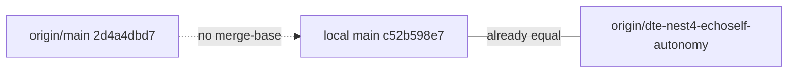

# Reconcile origin/main with nest-4 (PR overlay)

## Current topology

- Local `main` already equals `[origin/dte-nest4-echoself-autonomy](https://github.com/orgitcog/u9n/tree/dte-nest4-echoself-autonomy)` at `c52b598e7`.
- `[origin/main](https://github.com/orgitcog/u9n/tree/main)` is an unrelated root (`2d4a4dbd7`). It already has nest-4 `DeepTreeEcho/` paths (from `e1`) **plus ~11,323**  `(2)` copy-paste files (`s4` / `e2` / `e3`).
- DeepTreeEcho / `Source/DeepTreeEcho` / `Source/EchoSelf` path sets match except those `(2)` copies. Remaining diffs are **modifications** (forwarding headers, autonomy wiring, [DeepTreeEcho.Build.cs](Source/DeepTreeEcho/DeepTreeEcho.Build.cs), [echoself.md](echoself.md)). Overlay will not drop unique origin/main DTE files.

Do **not** merge unrelated histories. Do **not** force-push `origin/main`.

## Approach

Work in a **separate git worktree** so this checkout does not replace the current workspace with `Engine/` / `videosrc/`.

1. `git fetch origin` then `git worktree add` a branch `dte-nest4-reconcile` at `origin/main`.
2. **Delete every tracked  `(2)` file** repo-wide (root docs, DeepTreeEcho, UnrealEcho, ThirdParty, scripts). These are Windows Explorer duplicates, not a second implementation.
3. **Overlay feature trees** from `c52b598e7` / local `main` onto that branch:
  - `DeepTreeEcho/`
  - `Source/DeepTreeEcho/`
  - `Source/EchoSelf/`
  - `echoself.md`
4. Leave origin/main-only trees untouched: `Engine/`, `Content/`, `videosrc/`, and non-`(2)` UnrealEcho / OpenCogEcho / docs.
5. Two commits (match existing style):
  - `Remove Windows (2) duplicate file copies from the tree.`
  - `Overlay nest-4 DeepTreeEcho and EchoSelf sources from dte-nest4-echoself-autonomy.`
6. Push `origin/dte-nest4-reconcile` and open a PR **into `origin/main`**.
7. Keep local `main` tracking `origin/dte-nest4-echoself-autonomy`. Do not retarget it at GitHub main.

## Verification

- `git ls-files` on the PR branch has **zero** paths matching  `(2)`.
- `git diff origin/main...HEAD -- DeepTreeEcho Source/DeepTreeEcho Source/EchoSelf echoself.md` matches `git diff origin/main main --` those paths, minus the deleted `(2)` files.
- PR does not add or remove `Engine/`, `Content/`, or `videosrc/`.

## Out of scope

- Rewriting the three same-subject nest commits on the feature branch (`40adbfb95` still has unique content; restore already landed as `c52b598e7`).
- Committing local untracked `.cursor/`, `Engine/`, or `videosrc/` in this workspace.

