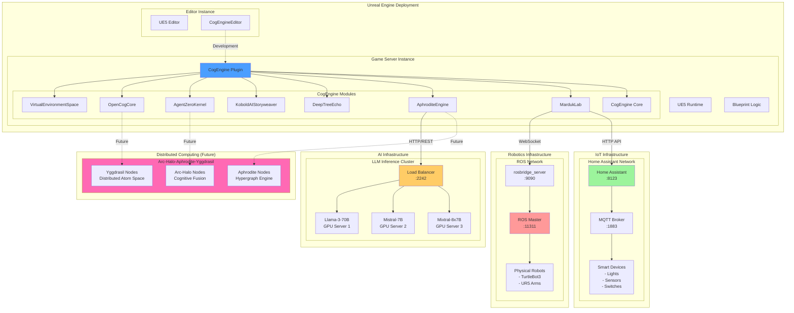
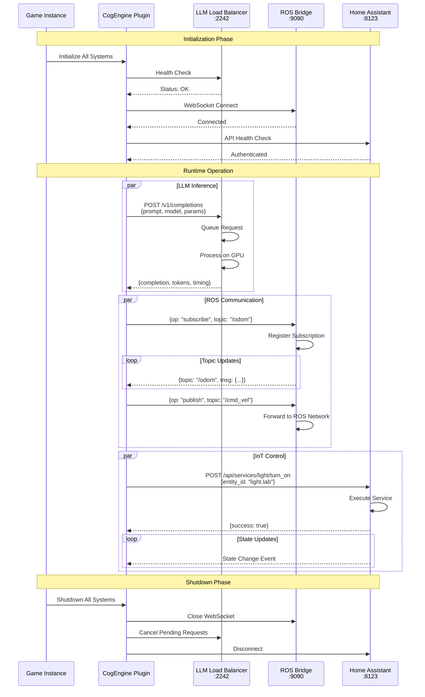
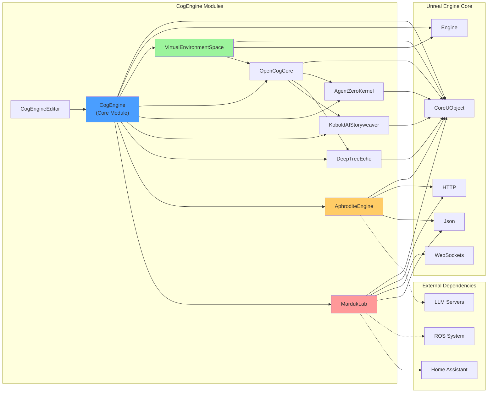
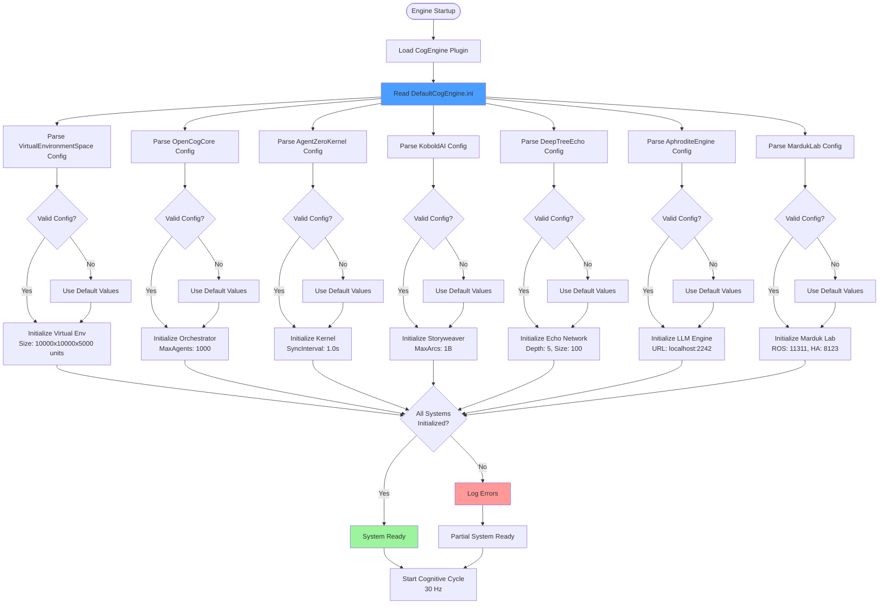
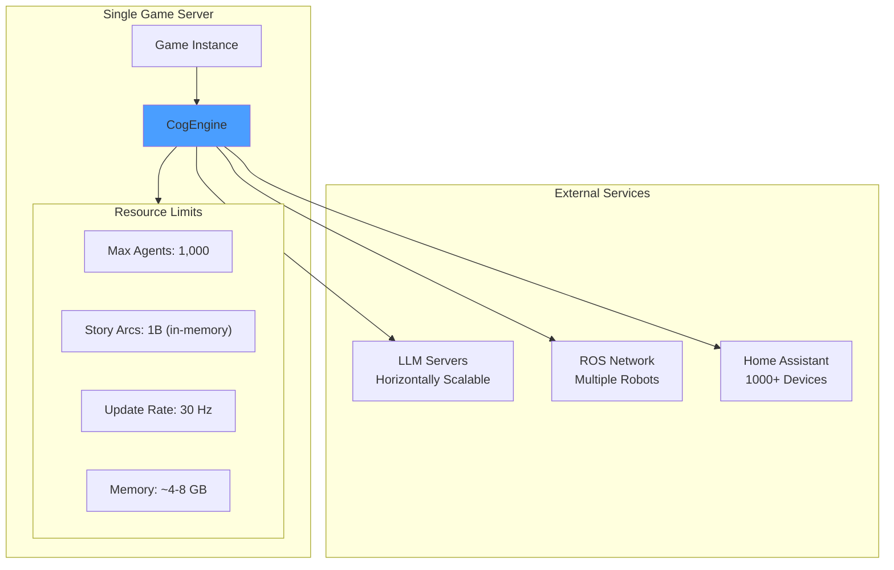
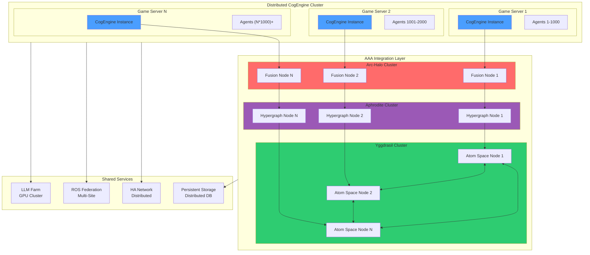
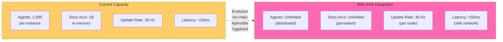
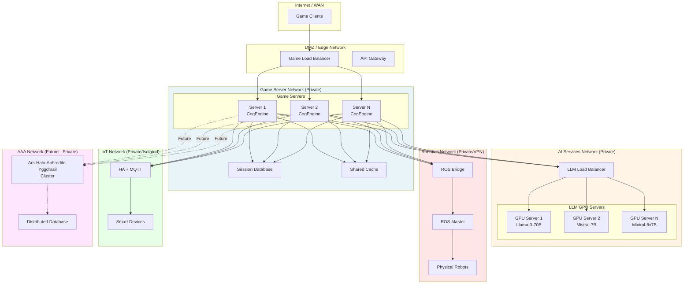
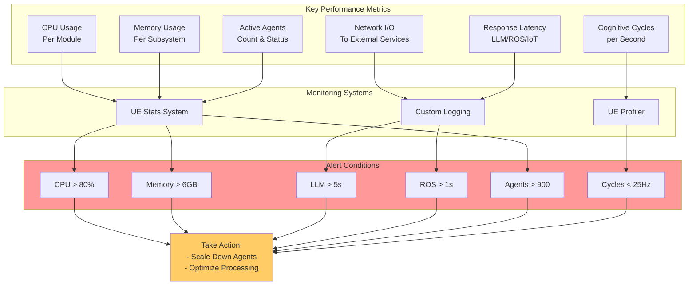

# CogEngine Deployment Architecture

This document contains Mermaid diagrams showing the deployment architecture and operational aspects of CogEngine.

## Table of Contents
1. [Deployment Architecture](#1-deployment-architecture)
2. [Network Communication](#2-network-communication)
3. [Module Dependencies](#3-module-dependencies)
4. [Configuration Flow](#4-configuration-flow)
5. [Scaling Architecture](#5-scaling-architecture)

---

## 1. Deployment Architecture

---

## 2. Network Communication

---

## 3. Module Dependencies

---

## 4. Configuration Flow

---

## 5. Scaling Architecture

### Current Scale (Single Instance)

### Future Scale (Distributed with AAA)

### Scaling Metrics

---

## Network Topology

---

## Performance Monitoring

---

*Last Updated: 2025-11-03*
*CogEngine Deployment Version: Experimental*
