# CogEngine System Integration Diagrams

This document contains Mermaid diagrams showing how the various systems in CogEngine are integrated.

## Table of Contents
1. [Overall System Architecture](#1-overall-system-architecture)
2. [Component Relationships](#2-component-relationships)
3. [Data Flow Diagram](#3-data-flow-diagram)
4. [Cognitive Cycle Sequence](#4-cognitive-cycle-sequence)
5. [Virtual Environment Integration](#5-virtual-environment-integration)
6. [Multi-Agent Orchestration](#6-multi-agent-orchestration)
7. [External System Integration](#7-external-system-integration)
8. [Future Architecture: Arc-Halo, Aphrodite, Yggdrasil](#8-future-architecture-arc-halo-aphrodite-yggdrasil)

---

## 1. Overall System Architecture

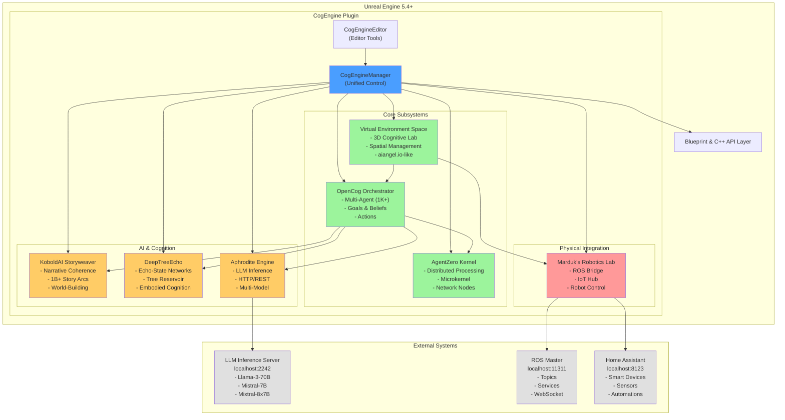

---

## 2. Component Relationships

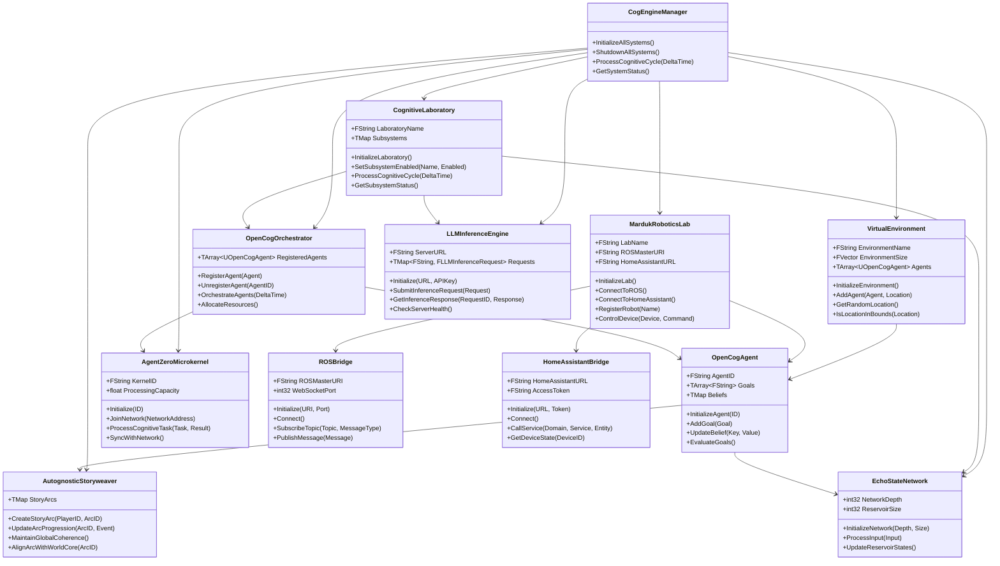

---

## 3. Data Flow Diagram

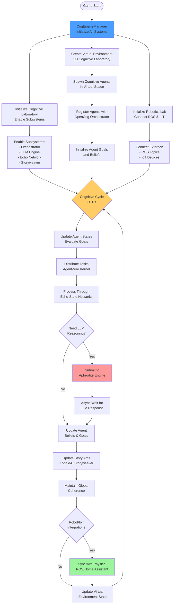

---

## 4. Cognitive Cycle Sequence

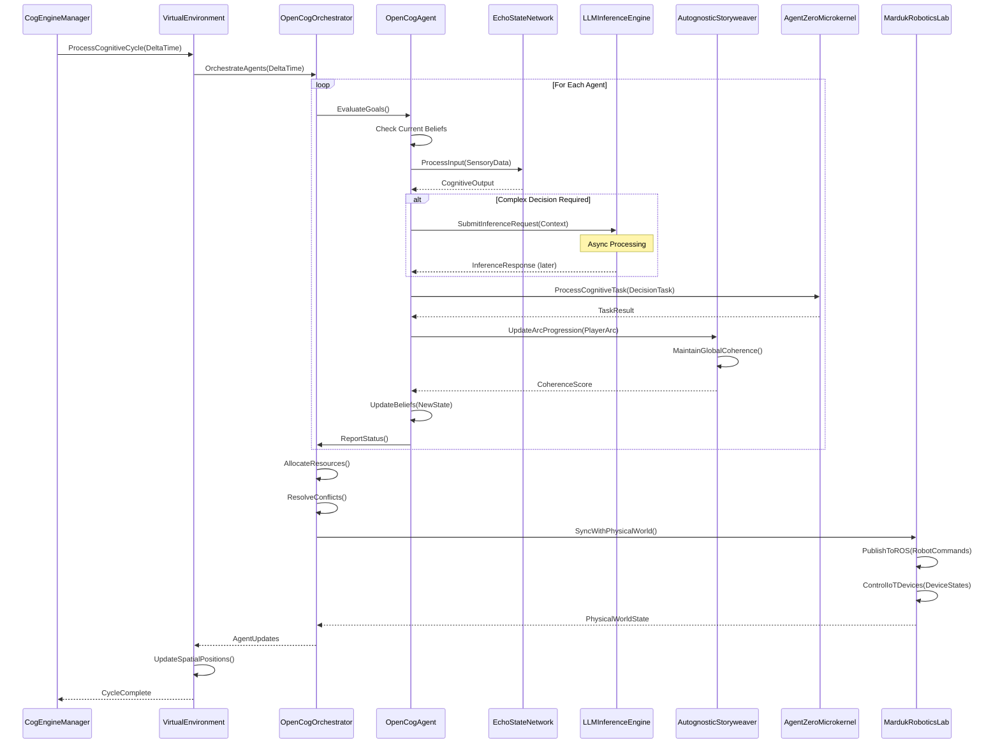

---

## 5. Virtual Environment Integration

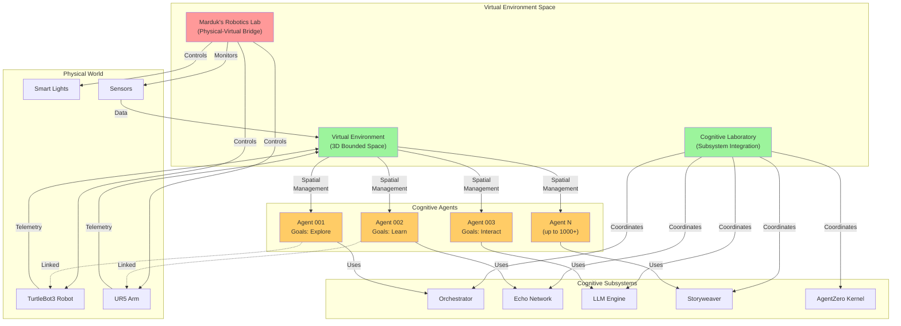

---

## 6. Multi-Agent Orchestration

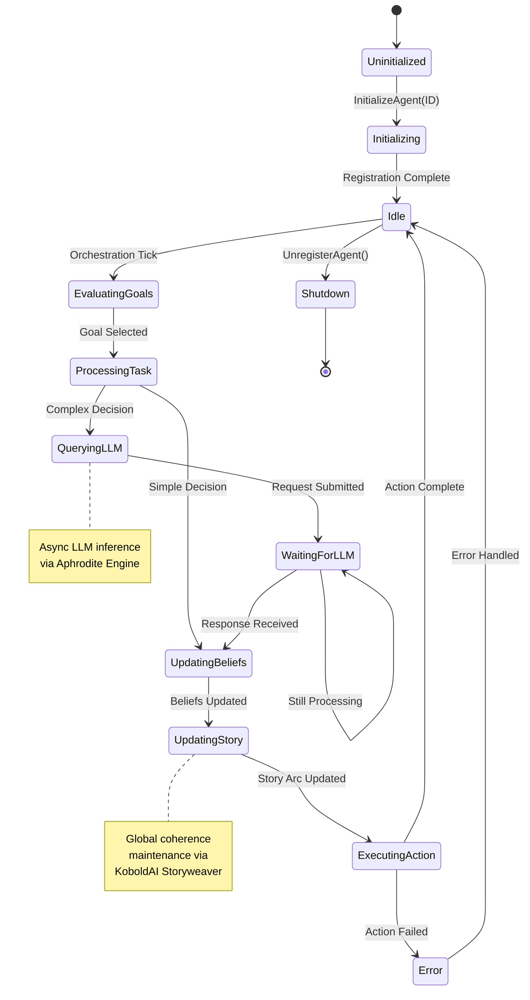

---

## 7. External System Integration

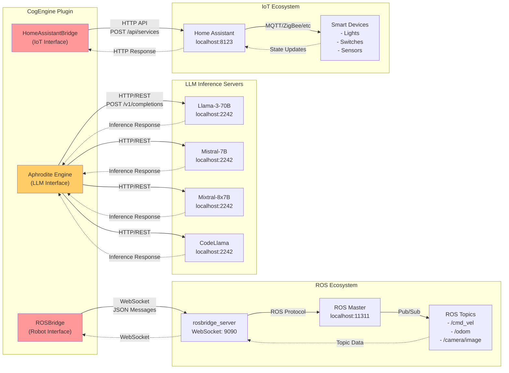

---

## 8. Future Architecture: Arc-Halo, Aphrodite, Yggdrasil

### Current vs. Future Integration

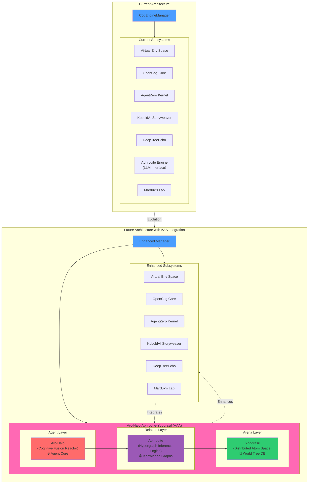

### AAA (Arc-Halo-Aphrodite-Yggdrasil) Detailed Architecture

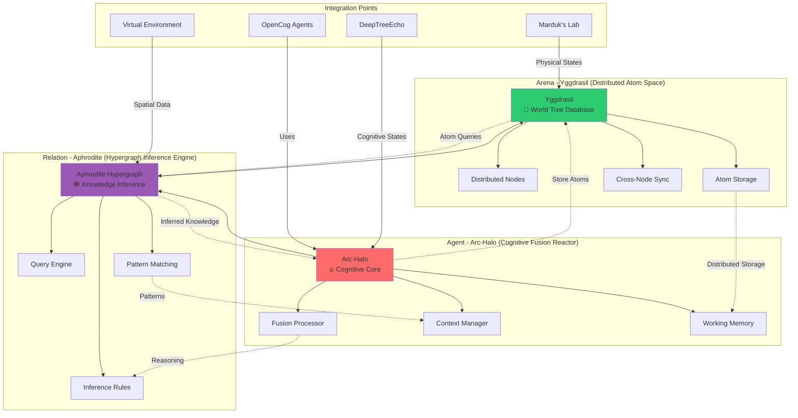

### AAA Integration Flow

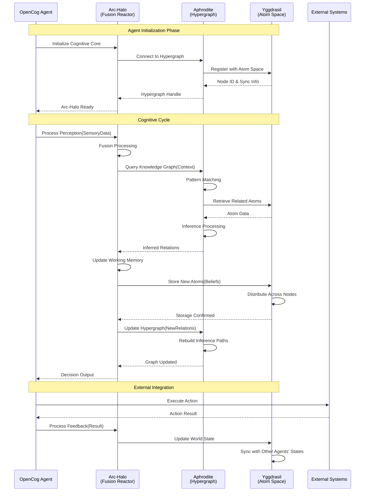

### AAA Data Flow

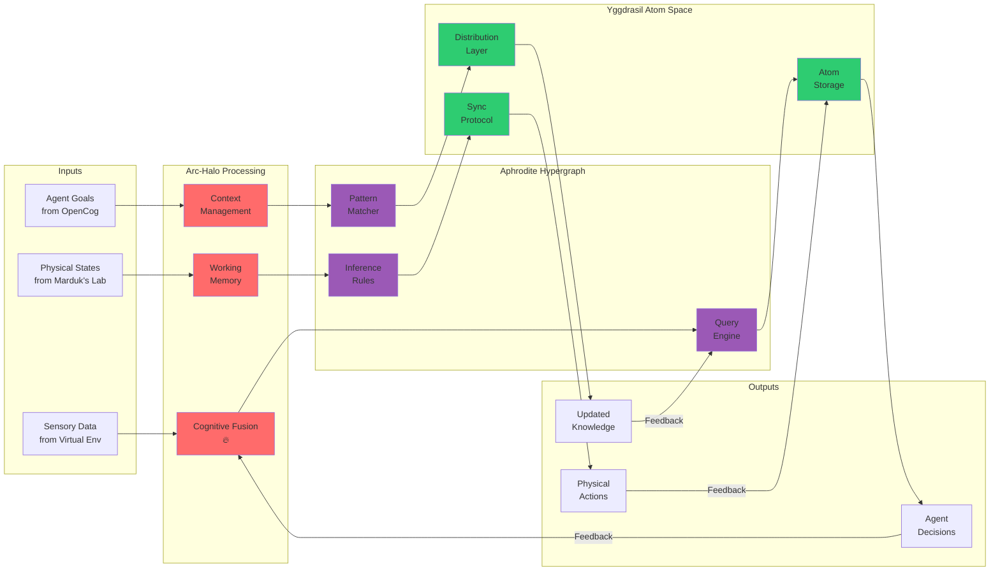

---

## System Characteristics

### Current System (Implemented)
- **9 Modules Total**: 8 Runtime Modules + 1 Editor Module
- **~4,800 Lines of Code**
- **1,000+ Concurrent Agents**
- **1 Billion+ Story Arcs**
- **30 Hz Cognitive Cycle**
- **100% Blueprint Support**

### Future System (With AAA Integration)
- **Agent Layer**: Arc-Halo provides unified cognitive fusion across all agent reasoning
- **Relation Layer**: Aphrodite hypergraph replaces simple LLM inference with sophisticated knowledge graph inference
- **Arena Layer**: Yggdrasil provides distributed, persistent atom space across the entire agent network

### Integration Benefits
1. **Arc-Halo (Cognitive Fusion Reactor)**
   - Unified cognitive processing core
   - Multi-modal fusion of sensory inputs
   - Context-aware reasoning

2. **Aphrodite (Hypergraph Inference Engine)**
   - Advanced knowledge representation beyond simple vectors
   - Relational reasoning and inference
   - Pattern-based learning and adaptation

3. **Yggdrasil (Distributed Atom Space)**
   - Persistent, distributed knowledge base
   - Cross-agent knowledge sharing
   - Scalable to planetary-scale agent networks

---

## Legend

- 🔥 **Arc-Halo**: Agent-level cognitive fusion
- 🕸️ **Aphrodite**: Relation-level hypergraph inference
- 🌳 **Yggdrasil**: Arena-level distributed atom space
- ✓ **Implemented**: Currently working in CogEngine
- ⚡ **Planned**: Future AAA integration

---

*Last Updated: 2025-11-03*
*CogEngine Version: Experimental*
