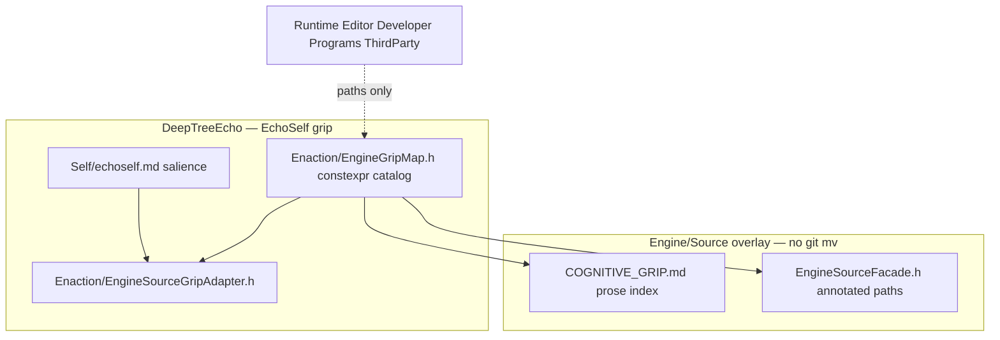

# Engine Source APL253 Cognitive Grip - Plan

## Goal Capsule

- **Objective:** Give EchoSelf a nest-4 cognitive grip on `Engine/Source` using A Pattern Language (APL253), without moving Epic Unreal Engine modules.
- **Authority:** This plan. Product behavior lives on R-IDs. Mechanism lives on KTD-IDs. Analog: `DeepTreeEcho/Self/COGNITIVE_GRIP.md` and `DeepTreeEcho/DeepTreeEchoFacade.h`. APL253 pattern files under the mad-plug `patterns/apl0/` tree bind pattern names; this plan records only deltas.
- **Execution profile:** Code. Characterization-first for the don't-move invariant. Standalone gtest; do not require a full Unreal Editor compile.
- **Stop conditions:** Stop if a change relocates `Engine/Source/Runtime`, `Editor`, `Developer`, `Programs`, or `ThirdParty`. Stop if a facade `#include`s Unreal public headers. Stop if `FAutonomyPipeline` input dimension changes from 38.
- **Tail ownership:** `ce-work` implements U1–U5. Do not restructure `DeepTreeEcho/` nest-4 in this pass.

## Product Contract

### Summary

EchoSelf already grips Deep Tree Echo through a nine-term OEIS A000081 nest-4 map. `Engine/Source` is a full Unreal Engine tree (`Runtime`, `Editor`, `Developer`, `Programs`, `ThirdParty`, plus four `Unreal*.Target.cs` files) with ~200 `Runtime` modules. Physically nesting that tree the way DeepTreeEcho was nested would break Unreal Build Tool module paths. This product adds a salience index, a header-only path catalog in DeepTreeEcho, EchoSelf heuristics, and a DTE-side adapter so EchoSelf and humans share one map of the engine source that already exists.

### Problem Frame

EchoSelf's `semantic-salience` in `DeepTreeEcho/Self/echoself.md` only names DeepTreeEcho nest roots. Unlisted Engine paths fall through to 0.5 and can enter prompt packing if the attention threshold is at or below 0.5. The nested-shell index raises named grip artifacts and nest-root identities so EchoSelf can rank Engine regions. It does not recursively walk Epic module trees. Engine nest terms are grip language (CoreRuntime, EngineWorld, …), not UBT folder names. Humans navigate the five Independent Regions (R2) and use the nine terms when coordinating with EchoSelf. Engine source is Epic-owned and UBT-addressed. Cognitive grip here is an overlay, not a relocation.

### Requirements

**Index and regions**

- R1. `Engine/Source` exposes a nest-4 (nine-term) cognitive map that EchoSelf can read as a living index, parallel in role to `DeepTreeEcho/Self/COGNITIVE_GRIP.md`.
- R2. The five UBT top-level directories (`Runtime`, `Editor`, `Developer`, `Programs`, `ThirdParty`) remain Independent Regions. Their on-disk paths do not change.
- R3. Each nest-4 term names one or more existing `Engine/Source` paths. ThirdParty is a mosaic (low salience), not a tenth nest-4 core.

**EchoSelf grip**

- R4. EchoSelf salience for every `Engine/Source/` path is strictly below `DeepTreeEcho/Self/` (0.95) and `DeepTreeEcho/Core/` (0.90), and never above 0.70.
- R4a. Path heuristics match `DeepTreeEcho/Self/COGNITIVE_GRIP.md` and `Engine/Source/COGNITIVE_GRIP.md` by full path. A bare `COGNITIVE_GRIP.md` substring must not score both files the same.
- R4b. Engine salience may rise only for grip artifacts and nest-root path identities used for ranking. Files under Epic hub modules stay out of `repo-file-list` packing (salience below any reachable adaptive-attention threshold, or an explicit Engine-leaf skip).
- R5. When Epic hubs such as `Engine/Source/Runtime/Core` are missing, grip code still compiles because the catalog lives under DeepTreeEcho. Existence checks return empty coverage. The autonomy tick does not crash.
- R5a. Runtime Engine inspect is directory-level, on the existing nest-4 beat (`TotalCycles % 12 == 0`). It does not recursively read Engine files during Tick.
- R6. A machine-readable catalog lists nest term, repo-relative path, salience, and one primary APL253 pattern id. Tests and C++ share that catalog. Markdown indexes are projections of it.
- R6a. `DeepTreeEcho/Self/COGNITIVE_GRIP.md` points at the Engine overlay so EchoSelf finds it from the Self nest.

**Compatibility**

- R7. The catalog, adapter, and any Engine-side projection headers do not `#include` Unreal Engine public headers.
- R8. `FAutonomyPipeline` input dimension stays 38.
- R9. Git stages named overlay files only: `DeepTreeEcho/Enaction/EngineGripMap.h`, `DeepTreeEcho/Enaction/EngineSourceGripAdapter.h`, `Engine/Source/COGNITIVE_GRIP.md`, `Engine/Source/EngineSourceFacade.h`, plus DTE heuristic/test/core-hook edits. It does not add the rest of the Engine tree.
- R9a. Do not add a sixth `Engine/Source` sibling module (`EchoGrip.Build.cs` or similar). UBT only discovers engine modules under Runtime, Editor, Developer, Programs, and ThirdParty.

### Actors

- A1. EchoSelf — inspects repository paths during recursive introspection and autonomy ticks.
- A2. Human developer — navigates `Engine/Source` through the same index.
- A3. Standalone gtest runner — proves the don't-move invariant and salience ordering without Unreal Editor.

### Key Flows

- F1. EchoSelf engine scan
  - **Trigger:** Nest-4 ingest beat (`TotalCycles % 12 == 0`) or an agent salience lookup of an `Engine/Source/...` path.
  - **Actors:** A1
  - **Steps:** If the tree is missing, skip. Else read the nine catalog terms plus an unclassified count. Apply salience. Prefer Public hub dirs over Private, Tests, ThirdParty, and `Engine/Plugins`.
  - **Outcome:** Directory-level engine hubs enter attention below DTE Self/Core. No recursive Engine file walk on Tick.
  - **Covered by:** R1, R4, R4a, R4b, R5, R5a, R6
- F2. Human index read
  - **Trigger:** A2 opens `Engine/Source/COGNITIVE_GRIP.md`.
  - **Actors:** A2
  - **Steps:** Read nest-4 table, APL253 citations, and don't-move rule. Follow listed paths that still exist on disk.
  - **Outcome:** The reader can name the nine terms and the five Independent Regions without moving folders.
  - **Covered by:** R1, R2, R3
- F3. Upgrade drift check
  - **Trigger:** A3 runs `EngineSourceGripTests`.
  - **Actors:** A3
  - **Steps:** Assert five top-level dirs are classified. When the tree is present, every KTD3 hub path still exists on disk. Fail if any named hub was relocated.
  - **Outcome:** Fail on a relocated named hub or an unclassified top-level dir. Do not enumerate every Runtime module.
  - **Covered by:** R2, R6

### Acceptance Examples

- AE1. Covers R2 / F3. Given the Engine tree is present, when tests run, then every KTD3 hub path still exists on disk and `Engine/Source/Runtime/Core` is classified as CoreRuntime.
- AE2. Covers R4 / F1. Adapter `SalienceFor("Engine/Source/Runtime/Core")` is compared to the documented DTE Self constant 0.95 from `echoself.md`. The engine hub score is lower. Engine-only `SalienceFor` returns 0.5 for non-engine paths and that 0.5 is not used as DeepTreeEcho Self salience.
- AE3. Covers R5. Given overlay catalog files under DeepTreeEcho and missing `Engine/Source/Runtime/Core`, when `EngineSourceGripTests` run, then catalog tests compile and pass, and existence checks skip rather than fail.
- AE4. Covers R7. Given `DeepTreeEcho/Enaction/EngineGripMap.h`, `DeepTreeEcho/Enaction/EngineSourceGripAdapter.h`, and `Engine/Source/EngineSourceFacade.h` if present, when inspected, then they contain no `#include` of Unreal public headers (`CoreMinimal.h`, `UObject/*.h`, module `Public/` headers).
- AE5. Covers R4a. Given `Engine/Source/COGNITIVE_GRIP.md` and `DeepTreeEcho/Self/COGNITIVE_GRIP.md`, when salience is evaluated, then the two files receive different scores and the DTE file is higher.

### Success Criteria

- EchoSelf can name nine engine nest terms and rank them.
- Epic module directories are bit-for-bit unmoved.
- `EngineSourceGripTests` pass under the existing DeepTreeEcho gtest CMake flow.
- AutonomyPipeline InputDim remains 38.

### Scope Boundaries

**In scope**

- Canonical catalog under DeepTreeEcho Enaction, plus regenerable Engine/Source prose and facade projections.
- EchoSelf heuristic update and a header-only DTE adapter. Relevance `addProvider` registration is deferred.
- Characterization tests in `DeepTreeEcho/Testing/UnitTests`.

**Deferred for later**

- Full Runtime-module census (200+ leaves) as first-class catalog rows.
- EchoSelf Ion dispatch or Level5/6 autonomy changes for engine modules.
- Physically nesting UnrealEcho, ReservoirEcho, or MetaHuman.
- Relevance `addProvider` hookup and capped hypergraph ingest of Engine Public headers.
- Resolving `Engine/Plugins/Experimental/CogEngine` module name `DeepTreeEcho`.

**Outside this product's identity**

- `git mv` of `Engine/Source/Runtime`, `Editor`, `Developer`, `Programs`, or `ThirdParty`.
- A sixth `Engine/Source` UBT sibling (`EchoGrip/`) or any patch to `RulesCompiler.cs`.
- `#include` of Epic Public headers from the Engine facade (the DTE facade analog that would compile-couple the megatree).
- Forwarding-header relocation of Epic modules.
- Re-doing DeepTreeEcho nest-4 folder moves.
- UE stub headers (`CoreMinimal.h` fakes) on Engine or DTE include paths.
- Committing `Engine/Binaries`, `Engine/DerivedDataCache`, or wholesale `Engine/`.
- Force-push of `origin/main`.

### Dependencies

- Local `Engine/Source` tree for existence assertions (optional per R5).
- Existing gtest harness in `DeepTreeEcho/Testing/UnitTests/CMakeLists.txt`.
- APL253 names: Independent Regions (1), Identifiable Neighborhood (4), Mosaic of Subcultures (8), Activity Nodes (30), Network of Paths (52), Building Complex (95), Circulation Realms (98), Pedestrian Street (100), Wings of Light (107), Intimacy Gradient (127), Sequence of Sitting Spaces (142), Structure Follows Social Spaces (205).

## Planning Contract

### Assumptions

- Physical DTE-style `git mv` of Engine source is infeasible. UBT `RulesCompiler.CreateEngineRulesAssemblyInternal` only scans Runtime, Developer, Editor, ThirdParty, and Programs. This is the one challenge to the folder-move analog in the DTE transcripts; the overlay is the surviving mechanism.
- `docs/solutions/` does not exist. Learnings come from `AGENTS.md` and `DeepTreeEcho/Self/COGNITIVE_GRIP.md`.
- Tests may run on machines where Engine is untracked or absent. R5 is the default. Engine is a full 5.6.1 drop and is not git-tracked today.
- Staging `Engine/Source/COGNITIVE_GRIP.md` and `EngineSourceFacade.h` is an explicit Engine commit of grip projections only, not a blanket Engine add. The constexpr catalog stays under DeepTreeEcho so it survives an Epic Engine replace and a missing Runtime/Core hub.
- An `EchoGrip.Build.cs` sibling under `Engine/Source` would be invisible to UBT. Rejected.

### Key Technical Decisions

- KTD1. Overlay, do not relocate. Prose index and facade comments live at `Engine/Source/` root. The constexpr catalog lives under DeepTreeEcho so an Epic Engine replace cannot delete it. Reject `git mv` of Epic regions. Reject a sixth Source sibling module. Evidence: `Engine/Source/Programs/UnrealBuildTool/System/RulesCompiler.cs` hardcodes the five directory names. Governs R2, R9, R9a.
- KTD2. Header-only path catalog is the source of truth. Canonical file: `DeepTreeEcho/Enaction/EngineGripMap.h` (always git-tracked). `Engine/Source/COGNITIVE_GRIP.md` and `Engine/Source/EngineSourceFacade.h` project that table. Lookup is longest-prefix on slash-normalized paths with a trailing-slash boundary so `Runtime/Core` does not match `Runtime/CoreUObject`. Each row stores one primary `aplId` (the first APL253 number listed for that term in KTD3); secondary ids stay in markdown prose. The facade is an annotated path index, not an include umbrella and not `DeepTreeEchoFacade.h` copied onto Epic Public headers. Governs R6, R7.
- KTD3. Nine nest-4 terms are named neighborhoods over unmoved hubs. Term 2 is **EngineWorld**, never **Self**, so the hologram does not collide with `DeepTreeEcho/Self/`. One primary term per hub path.

  | Term | Overlay name | DTE analog | Hub paths (unmoved) | APL253 |
  |------|----------------|------------|---------------------|--------|
  | 1 | CoreRuntime | Core | `Engine/Source/Runtime/Core`, `Engine/Source/Runtime/CoreUObject`, `Engine/Source/Runtime/Launch`, `Engine/Source/Runtime/Projects` | 1, 95 |
  | 2 | EngineWorld | (not Self) | `Engine/Source/Runtime/Engine`, `Engine/Source/Runtime/EngineSettings` | 30 |
  | 3 | RenderReservoir | Reservoir | `Engine/Source/Runtime/RenderCore`, `Engine/Source/Runtime/RHI`, `Engine/Source/Runtime/Renderer`, `Engine/Source/Runtime/StateStream` | 30 |
  | 4 | BodyRuntime | Cognition4E | `Engine/Source/Runtime/InputCore`, `Engine/Source/Runtime/Slate`, `Engine/Source/Runtime/SlateCore`, `Engine/Source/Runtime/UMG`, `Engine/Source/Runtime/ApplicationCore` | 8 |
  | 5 | MemoryRuntime | Memory | `Engine/Source/Runtime/Serialization`, `Engine/Source/Runtime/PakFile`, `Engine/Source/Runtime/AssetRegistry` | 95 |
  | 6 | EditorAttention | Attention | `Engine/Source/Editor`, `Engine/Source/Runtime/TypedElementFramework`, `Engine/Source/Runtime/GameplayDebugger` | 107 |
  | 7 | NetStreams | Streams | `Engine/Source/Runtime/Net`, `Engine/Source/Runtime/Networking`, `Engine/Source/Runtime/Sockets`, `Engine/Source/Runtime/Online`, `Engine/Source/Runtime/AudioMixer` | 52, 100 |
  | 8 | ActionRuntime | Enaction | `Engine/Source/Runtime/AIModule`, `Engine/Source/Runtime/GameplayTasks`, `Engine/Source/Runtime/NavigationSystem` | 30, 52 |
  | 9 | DevWisdom | Wisdom | `Engine/Source/Developer`, `Engine/Source/Programs`, `Engine/Source/UnrealEditor.Target.cs`, `Engine/Source/UnrealGame.Target.cs`, `Engine/Source/UnrealServer.Target.cs`, `Engine/Source/UnrealClient.Target.cs` | 95, 205 |

  `Engine/Source/ThirdParty` is a catalog row at salience ≤ 0.15. `Engine/Plugins` is mosaic/countryside at the same ceiling. Unclassified Runtime dirs degrade at 0.30 and do not fail Tick. Catalog lookup is longest-prefix on slash-normalized paths with a trailing-slash boundary. Secondary APL numbers (95 on CoreRuntime, 100 on NetStreams, 52 on ActionRuntime, 205 on DevWisdom) are prose-only. Governs R1, R3.
- KTD4. Salience ceiling and flood control. All `Engine/Source/` scores ≤ 0.70. Insert `Engine/Source/` clauses in `echoself.md` **before** `else 0.5`. Prefer `*/Public` over `*/Private` and `*/Tests`. Bare `COGNITIVE_GRIP.md` becomes two full-path clauses (DTE 0.80, Engine 0.70). Governs R4, R4a.
- KTD5. Adapter lives in DTE Enaction. `DeepTreeEcho/Enaction/EngineSourceGripAdapter.h` is header-only and includes `"EngineGripMap.h"` from the same directory. One call site on the existing nest-4 ingest beat upserts nine directory terms plus unclassified count. Engine-only `SalienceFor` returns 0.5 for non-engine paths; that 0.5 is not DeepTreeEcho Self salience (Self stays the documented 0.95 in `echoself.md`). No file walk. No `RelevanceArbiter.h` edit. No InputDim change. Governs R5, R5a, R8.
- KTD6. Test the five Independent Regions, the KTD3 hubs, AE5 disambiguation, and no-UE-include. Do not snapshot all Runtime module names. Unclassified extras must not fail the autonomy path; tests may warn. Governs F3.
- KTD7. Do not land stub `CoreMinimal.h` or fake `GameFramework/` on include paths. Offline UE stubs stay in `DeepTreeEcho/_legacy/UEStubs/` if they exist. Governs R7.

### High-Level Technical Design

Nest-1 is `Engine/Source`. Nest-2 is Runtime + Editor. Nest-3 adds Developer + Programs. Nest-4 is the nine terms in KTD3. ThirdParty stays a mosaic sibling, not a tenth nest-4 core.

### Sequencing

U1 catalog and markdown (shared contract) → U2 facade projection → U3 EchoSelf heuristics → U4 adapter → U5 tests that lock U1–U4.

### Sources and Research

- `Engine/Source` layout observed: full UE **5.6.1** drop (`Developer`, `Editor`, `Programs`, `Runtime`, `ThirdParty`, four Target.cs). ~870 `.Build.cs`. Not git-tracked (`git ls-files Engine` is empty).
- UBT smoking gun: `Engine/Source/Programs/UnrealBuildTool/System/RulesCompiler.cs` `CreateEngineRulesAssemblyInternal` adds modules only from Runtime, Developer, Editor, ThirdParty, and Programs.
- DTE analog: `DeepTreeEcho/Self/COGNITIVE_GRIP.md`, `DeepTreeEcho/DeepTreeEchoFacade.h`, `DeepTreeEcho/Self/echoself.md` `semantic-salience`. Copy the overlay, not the `git mv`.
- Grip math: `DeepTreeEcho/Attention/Relevance/vendored/cog/grip/grip.hpp`. Do not vendor a second copy into Engine.
- APL253 load-bearing: 1, 4, 8, 30, 52, 95, 98, 100, 107, 127, 142, 205. Domain map: region→UBT directory, street→Public include path, light→index visibility. `domain-transformations.md` is missing; `gh253_domain_mappings.json` holds software names.
- `AGENTS.md`: do not commit Engine unless asked; this plan asks only for `Engine/Source/COGNITIVE_GRIP.md` and `Engine/Source/EngineSourceFacade.h`. Never force-push `origin/main`. AutonomyPipeline InputDim stays 38.
- Failed analog: `EchoGrip.Build.cs` as a sixth Source sibling (UBT would ignore it). Failed analog: Engine facade that `#include`s Epic Public headers.
- Collision (out of scope): `Engine/Plugins/Experimental/CogEngine` already has a module named `DeepTreeEcho`.
- External APL253 plus UBT research is load-bearing for KTD1, KTD2, and KTD3.

## Implementation Units

### U1. Engine grip catalog and prose index

- **Goal:** Land the constexpr catalog and the human/EchoSelf markdown index for the nine terms.
- **Requirements:** R1, R2, R3, R6, R6a
- **Dependencies:** none
- **Files:**
  - Create `DeepTreeEcho/Enaction/EngineGripMap.h`
  - Create `Engine/Source/COGNITIVE_GRIP.md`
  - Modify `DeepTreeEcho/Self/COGNITIVE_GRIP.md`
  - Test `DeepTreeEcho/Testing/UnitTests/EngineSourceGripTests.cpp` (created in U5; U1 must be testable from it)
- **Approach:**
  1. Define `enum class EEngineNestTerm` with the nine overlay names in KTD3 plus `MosaicThirdParty` and `UnclassifiedRuntime`.
  2. Define a `struct FEngineGripEntry { term, path, salience, aplId }`. Keep `aplId` singular; store the first APL253 number for that term in KTD3.
  3. Publish a constexpr array covering every KTD3 hub path plus `Engine/Source/ThirdParty`. Paths are repo-relative. Lookup is longest-prefix on slash-normalized paths with a trailing-slash boundary.
  4. Write `Engine/Source/COGNITIVE_GRIP.md` as a projection: nest-4 table, DTE analog column, APL citations (including secondary ids), don't-move banner, salience table, pointer to `DeepTreeEcho/Enaction/EngineGripMap.h`.
  5. Add a short pointer section on `DeepTreeEcho/Self/COGNITIVE_GRIP.md` (R6a).
- **Patterns to follow:** `DeepTreeEcho/Self/COGNITIVE_GRIP.md` tone and nest-4 table shape. Catalog is std C++17 only.
- **Test scenarios:**
  - Happy path: catalog contains exactly nine nest terms plus mosaic; each KTD3 hub path is present. Catalog `SalienceFor("Engine/Source/Runtime/Core")` returns the CoreRuntime hub salience and does not match CoreUObject.
  - Edge: duplicate path rows are rejected (test uniqueness).
  - Covers AE1: `Engine/Source/Runtime/Core` maps to CoreRuntime.
- **Verification:** Header compiles in isolation (`#include "EngineGripMap.h"` from Enaction, with no UE headers). Markdown names the same hubs as the array.
- **Execution note:** Add characterization coverage for unmoved hub paths before any later edit to Engine layout.

### U2. Annotated facade without UE includes

- **Goal:** Give humans and EchoSelf a single header that groups catalog paths the way `DeepTreeEchoFacade.h` groups DTE includes, without compiling Unreal.
- **Requirements:** R1, R7
- **Dependencies:** U1
- **Files:**
  - Create `Engine/Source/EngineSourceFacade.h`
  - Test `DeepTreeEcho/Testing/UnitTests/EngineSourceGripTests.cpp`
- **Approach:**
  1. Include only `#include "DeepTreeEcho/Enaction/EngineGripMap.h"` (repo-root include already on the UnitTests target). Do not copy lookup helpers onto the facade.
  2. Comment nine regions with the catalog paths. Do not `#include` `CoreMinimal.h` or module Public headers.
  3. Path lookup (`TermFor` / `SalienceFor`) lives on the catalog and the U4 adapter, not on this header.
- **Patterns to follow:** Region comment blocks in `DeepTreeEcho/DeepTreeEchoFacade.h`. Do not copy its `#include` list.
- **Test scenarios:**
  - Covers AE4: facade and map files have no Unreal public includes.
  - Happy path: facade compiles as a comment projection of the nine regions.
- **Verification:** Facade is a valid C++ header under the unit-test include path.

### U3. EchoSelf salience heuristics for Engine/Source

- **Goal:** Teach EchoSelf's Scheme salience the engine nest fragments without outranking DTE Self/Core, and without scoring both grip markdown files the same.
- **Requirements:** R4, R4a
- **Dependencies:** U1
- **Files:**
  - Modify `DeepTreeEcho/Self/echoself.md`
  - Test `DeepTreeEcho/Testing/UnitTests/EngineSourceGripTests.cpp`
- **Approach:**
  1. Replace the bare `COGNITIVE_GRIP.md` clause with full-path clauses. Keep `DeepTreeEcho/Self/COGNITIVE_GRIP.md` at 0.80 ahead of any generic `Engine/Source/` fallback. Name `Engine/Source/COGNITIVE_GRIP.md` at 0.70 so it is not scored as an unclassified engine leaf.
  2. Insert hub `Engine/Source/` clauses **before** `else 0.5` and **after** the two full-path grip-index clauses. Hub scores 0.55–0.70, unclassified Runtime 0.30, ThirdParty ≤ 0.15, matching KTD4. Prefer `*/Public` over `*/Private` and `*/Tests`.
  3. Place engine clauses after DTE nest clauses. All engine scores stay ≤ 0.70.
- **Patterns to follow:** Existing `semantic-salience` cond in `DeepTreeEcho/Self/echoself.md`.
- **Test scenarios:**
  - Covers AE2: adapter `SalienceFor` on `Engine/Source/Runtime/Core` is compared to the documented DTE Self constant 0.95; the engine hub is lower. Do not treat the engine-unknown 0.5 default as DeepTreeEcho Self salience.
  - Covers AE5: the two `COGNITIVE_GRIP.md` files differ; DTE file is higher.
  - Happy path: `Engine/Source/ThirdParty` salience ≤ 0.15.
  - Edge: `Engine/Source/Runtime/UnknownModule` uses unclassified 0.30, below mapped CoreRuntime.
- **Verification:** Heuristic table in markdown matches catalog saliences for the named prefixes.

### U4. Enaction adapter

- **Goal:** Let nest-4 ingest consult the engine catalog when the tree exists, without changing AutonomyPipeline width or walking Engine files.
- **Requirements:** R5, R5a, R8
- **Dependencies:** U1
- **Files:**
  - Create `DeepTreeEcho/Enaction/EngineSourceGripAdapter.h`
  - Modify the existing nest-4 ingest call site in `DeepTreeEcho/Core/DeepTreeEchoCore.cpp` (one hook next to CoreSelf ingest)
  - Test `DeepTreeEcho/Testing/UnitTests/EngineSourceGripTests.cpp`
- **Approach:**
  1. Header-only adapter: `EngineTreePresent(repoRoot)`, `Entries()`, `SalienceFor(path)`, `UnclassifiedRuntimeCount(repoRoot)` when the tree exists. Include `"EngineGripMap.h"` from the same Enaction directory (UnitTests already include `DeepTreeEcho/`).
  2. Presence check looks for `Engine/Source/Runtime/Core` relative to repo root. Missing tree yields empty coverage.
  3. On `TotalCycles % 12 == 0`, upsert nine directory-level terms plus unclassified count. Do not read Engine file contents.
  4. Do not add reservoir inputs. Do not edit `RelevanceArbiter.h`.
- **Patterns to follow:** Existing nest-4 ingest cadence in `DeepTreeEcho/Core/DeepTreeEchoCore.cpp`. Header-only helpers tested like `RelevanceKernelTests.cpp`. `grip.hpp` is not copied.
- **Test scenarios:**
  - Covers AE3: adapter reports absent when the Core hub directory is missing (injectable root path).
  - Covers AE2: `SalienceFor("Engine/Source/Runtime/Core")` is below the documented DTE Self constant 0.95. `SalienceFor` on a DeepTreeEcho path returns 0.5 and that value is not used as Self salience.
  - Integration: a KTD3 hub scores in 0.55–0.70, ThirdParty is ≤ 0.15, and an unclassified Runtime leaf returns 0.30.
  - Failure: repo root nullptr/empty yields absent, not UB.
- **Verification:** AutonomyPipeline config and InputDim are untouched in the diff. No recursive Engine directory walk on the hot Tick path.

### U5. Characterization tests and CMake target

- **Goal:** Lock don't-move, classification, salience order, and no-UE-include rules in gtest.
- **Requirements:** R2, R4, R4a, R5, R6, R7
- **Dependencies:** U1, U2, U3, U4
- **Files:**
  - Create `DeepTreeEcho/Testing/UnitTests/EngineSourceGripTests.cpp`
  - Modify `DeepTreeEcho/Testing/UnitTests/CMakeLists.txt`
- **Approach:**
  1. Add `EngineSourceGripTests` executable mirroring `RelevanceKernelTests` (gtest, include `DeepTreeEcho/` and repo root).
  2. Add it to `run_all_tests` DEPENDS and install TARGETS.
  3. Add `target_compile_definitions(EngineSourceGripTests PRIVATE UN9N_REPO_ROOT="${CMAKE_SOURCE_DIR}/../../..")`. Resolve `EngineTreePresent` / AE1 existence checks from that compile-time root, not from process cwd. Keep gtest `WORKING_DIRECTORY` as `${CMAKE_BINARY_DIR}` to match `RelevanceKernelTests`. Classification iterates immediate children of `Engine/Source` only. When Core is missing, skip AE1 existence asserts; still run catalog and include-policy tests.
  4. Include-policy test reads facade/map/adapter source as text and forbids `CoreMinimal.h`, `UObject/`, and module `Public/` headers.
- **Patterns to follow:** `RelevanceKernelTests` target block in `DeepTreeEcho/Testing/UnitTests/CMakeLists.txt`.
- **Test scenarios:**
  - Covers AE1, AE2, AE3, AE4, AE5.
  - Edge: top-level `Engine/Source` child dir that is not one of the five Independent Regions plus Target.cs files fails the classification test (today: exactly those five dirs).
  - Integration: catalog path uniqueness + markdown contains each hub path string.
- **Verification:** `ctest -R EngineSourceGripTests --output-on-failure` from the unit-test build dir passes.
- **Execution note:** Prefer this gtest over a Unreal Automation Test so CI can run without compiling the Editor.

## Verification Contract

| Gate | Command | Applies | Proves |
|------|---------|---------|--------|
| Unit | Configure `DeepTreeEcho/Testing/UnitTests` with existing CMake, then `ctest -R EngineSourceGripTests --output-on-failure` | U1–U5 | AE1–AE4, don't-move, salience order |
| Diff policy | `git diff --name-only` must not list relocated Runtime/Editor/Developer/Programs/ThirdParty trees | U1–U5 | R2, R9 |
| InputDim | Diff must not change AutonomyPipeline input dimension literals away from 38 | U4 | R8 |
| Full UE compile | Not required | — | Out of scope |

`release:validate` does not apply. No browser tests. Skill evaluation: EchoSelf can read `Engine/Source/COGNITIVE_GRIP.md` and apply `echoself.md` clauses (F1).

## Definition of Done

**Global**

- R1–R9a are met. AE1–AE5 pass or skip only under R5 absence.
- No Epic module directory was moved.
- Abandoned experimental Engine layout scripts are not left in the tree.
- Only named overlay files (DTE catalog/adapter/heuristics/tests plus Engine/Source prose and facade) are staged.

**Per unit**

- U1. Catalog and markdown agree on KTD3.
- U2. Facade compiles without UE headers.
- U3. EchoSelf engine scores stay below DTE Self/Core.
- U4. Adapter degrades when Engine is missing. InputDim unchanged.
- U5. `EngineSourceGripTests` is on `run_all_tests`.

## System-Wide Impact

- EchoSelf attention will start noticing named engine hubs. Per R4b, files under Epic hub modules stay out of packing; only grip artifacts and nest-root identities may rise. Keep the raised set to KTD3 so packing stays bounded.
- Unreal Build Tool is unaffected because module paths do not change.
- Git hygiene: two Engine projection files plus the DTE catalog/adapter/tests are committable; the rest of Engine stays untracked per `AGENTS.md` unless a later request expands that.

## Risks and Dependencies

- Risk: Engine tree absent on CI. Mitigation: R5 skip of existence asserts; catalog compiles from DeepTreeEcho.
- Risk: Someone treats the facade as a place to `#include` `CoreUObject`. Mitigation: AE4 text scan.
- Risk: Catalog and markdown drift. Mitigation: U5 string-contains check for each hub path.
- Risk: Blanket `git add Engine`. Mitigation: R9; stage named overlay files only.
- Risk: U5 is the first UnitTests use of `std::filesystem`; MSVC C++17 links it, but older libstdc++ may need an extra filesystem library flag the current CMakeLists.txt does not set.
- Risk: Top-level listing of `Engine/Source` is slow on a full Windows checkout. Mitigation: classify immediate children only.

## Open Questions

None blocking. Deferred: whether a later pass catalogs every Runtime module as Identifiable Neighborhoods (APL 4) once the hub overlay is stable.
