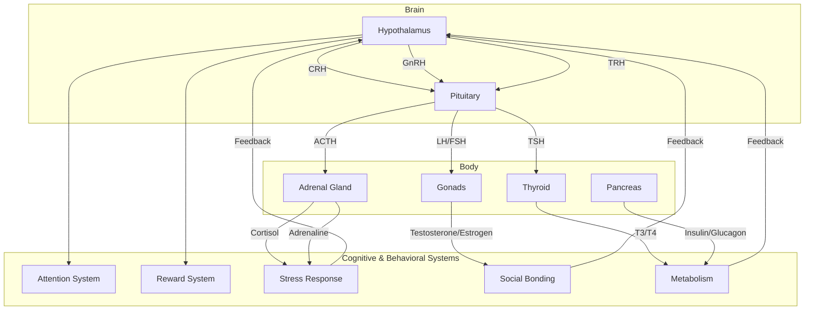

# Epic 4: Digital Endocrine System - Detailed Specifications

**Version:** 1.0.0-alpha  
**Last Updated:** January 10, 2026

---

## Overview

The Digital Endocrine System (DES) is a computational model of the biological endocrine system, designed to provide realistic, homeostatic regulation of the AGI's cognitive and behavioral states. It introduces a layer of autonomous, subconscious feedback that modulates everything from attention and motivation to stress and social bonding, creating a more life-like and adaptive agent.

## Core Principles

- **Homeostasis:** The DES constantly seeks to maintain a stable internal equilibrium (homeostasis) by adjusting hormonal concentrations in response to internal and external stimuli.
- **Feedback Loops:** The system is built on a series of nested negative and positive feedback loops, where the output of a hormone can inhibit or excite its own production.
- **Hormonal Cascades:** Hormones often trigger the release of other hormones in a cascade, allowing for complex, multi-stage responses.
- **Tonic and Phasic Release:** The system supports both slow, background (tonic) release and rapid, event-driven (phasic) release of hormones.

## System Architecture

The DES is implemented as a set of interconnected components, each representing a major endocrine axis. These components communicate through a global "bloodstream" simulation, where hormone concentrations are stored and updated.

## Detailed Feature Specifications

### Phase 4.1: Hypothalamic-Pituitary Axis

- **F4.1.1: Hypothalamus Core Controller:** A central component that receives input from various brain regions (e.g., amygdala, prefrontal cortex) and the body (e.g., temperature, energy levels). It integrates these signals to control the pituitary gland.
- **F4.1.2: Pituitary Gland Simulation:** A model of the anterior and posterior pituitary, releasing a variety of hormones (e.g., ACTH, TSH, LH, FSH, vasopressin, oxytocin) in response to signals from the hypothalamus.
- **F4.1.3: Releasing Hormone Dynamics:** Mathematical models (e.g., differential equations) for the production and release of hypothalamic hormones like CRH, GnRH, and TRH.
- **F4.1.4: Feedback Loop Architecture:** A generic framework for implementing negative feedback loops, where downstream hormones inhibit the release of upstream hormones (e.g., cortisol inhibiting CRH and ACTH).
- **F4.1.5: Circadian Rhythm Generator:** An internal clock that modulates the baseline release of various hormones over a 24-hour cycle, influencing sleep-wake patterns and energy levels.
- **F4.1.6: Stress Response Cascade:** The initial trigger for the HPA axis, where the hypothalamus releases CRH in response to perceived threats or stressors.

### Phase 4.2: Stress & Arousal System (HPA Axis)

- **F4.2.1: Cortisol Dynamics Model:** A model of cortisol release from the adrenal gland, including its slow-acting effects on metabolism, inflammation, and cognition.
- **F4.2.2: Adrenaline/Noradrenaline System:** A model of the sympathetic nervous system's rapid release of adrenaline and noradrenaline, leading to increased heart rate, alertness, and energy mobilization.
- **F4.2.3: Fight-Flight-Freeze Response:** A decision-making module that selects between fight, flight, or freeze responses based on the perceived threat, AGI's capabilities, and hormonal state.
- **F4.2.4: Chronic Stress Adaptation:** A mechanism for the system to adapt to long-term stress, including potential desensitization of receptors and altered baseline hormone levels.
- **F4.2.5: Recovery & Restoration:** A process for the system to return to baseline after a stress response, including the activation of the parasympathetic nervous system.
- **F4.2.6: Allostatic Load Tracking:** A metric to quantify the cumulative wear and tear on the system from chronic stress, which can impact long-term health and performance.

### Phase 4.3: Reward & Motivation System

- **F4.3.1: Dopamine Circuit Simulation:** A model of the mesolimbic dopamine pathway, linking the ventral tegmental area (VTA) to the nucleus accumbens. Dopamine release is associated with reward prediction and motivation.
- **F4.3.2: Reward Prediction Error:** Implementation of a temporal difference learning algorithm to calculate the reward prediction error (RPE), which drives dopamine release.
- **F4.3.3: Incentive Salience:** A mechanism where dopamine 
