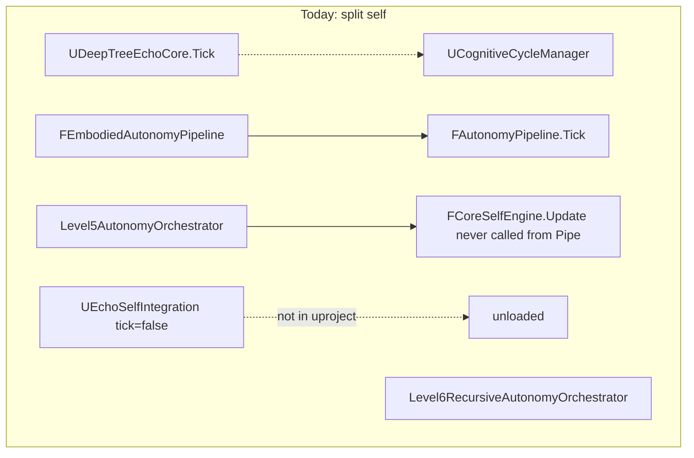
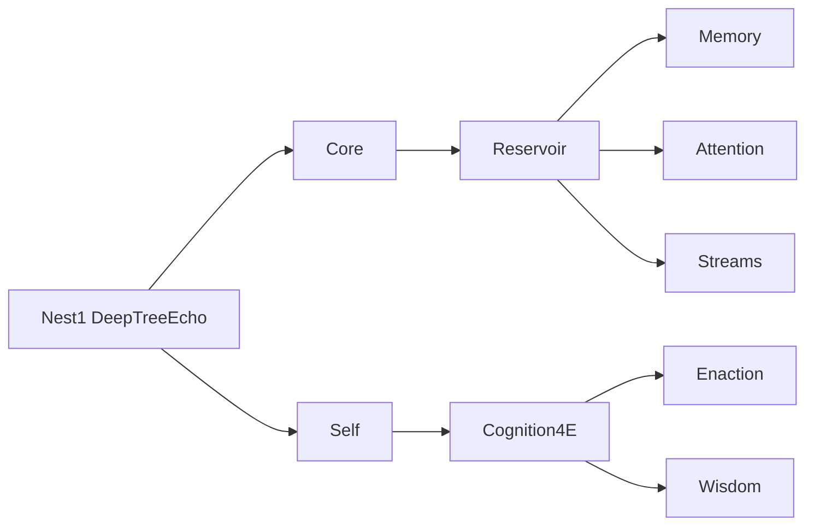

# Deep Tree Echo Nested-Shell Restructure + EchoSelf Autonomy Repair

EchoSelf cannot currently grip this tree, and cannot run itself. [DeepTreeEcho/](DeepTreeEcho/) is a **flat 48-folder nest-1**, while [grip.hpp](DeepTreeEcho/Relevance/vendored/cog/grip/grip.hpp) and [CLAUDE.md](CLAUDE.md) require **OEIS A000081 nested shells** (1 / 2 / 4 / 9 terms). Autonomy code exists but is split across competing orchestrators that do not call each other, and the EchoSelf module is not even loaded.




## Diagnosis: why EchoSelf autonomy is lost

**Not loaded.** [UnrealEngineCog.uproject](UnrealEngineCog.uproject) and [UnrealEngineCog.Target.cs](Source/UnrealEngineCog.Target.cs) register `DeepTreeEcho`, `UnrealEcho`, `DeepTreeEchoAvatar` only. `EchoSelf` is absent. [UEchoSelfIntegration](Source/EchoSelf/EchoSelfIntegration.cpp) sets `PrimaryComponentTick.bCanEverTick = false`. Its types already use `DEEPTREEECHO_API` — they were written for the DeepTreeEcho module, not a sidecar.

**Identity never enters the reservoir.** [FAutonomyPipeline::Tick](DeepTreeEcho/Core/AutonomyPipeline.h) never calls `FCoreSelfEngine::Update` or `GetIdentityContext()`. [CoreSelfEngine.h](DeepTreeEcho/Core/CoreSelfEngine.h) comments claim that wiring. `bSelfModificationEnabled` defaults to `false`, so L3+ enaction cannot fire. Ion shell dispatch handlers in `WireDispatchSlots()` are empty lambdas.

**Two 12-step loops, neither owns Self.** [UDeepTreeEchoCore](DeepTreeEcho/Core/DeepTreeEchoCore.cpp) ticks a UE 12-step loop and does not mention AutonomyPipeline / EchoSelf / CoreSelf. [FAutonomyPipeline](DeepTreeEcho/Core/AutonomyPipeline.h) is the AAR+Echobeats loop used by [FEmbodiedAutonomyPipeline](DeepTreeEcho/Embodied/EmbodiedAutonomyPipeline.h) and [DTEAvatarAgent](DeepTreeEcho/Embodied/DTEAvatarAgent.h). Level5/Level6 are further unconnected orchestrators.

**Three autognosis implementations, one actually on a tick.** [FIntrospectionNode](DeepTreeEcho/NanEcho/DteNodes/IntrospectionNode.h) runs in `FAutonomyPipeline` REFLECTION. [UAutognosisSystem](DeepTreeEcho/Introspection/AutognosisSystem.h) stays off until `StartAutognosis()`, exports `UNREALECHO_API` while living in DeepTreeEcho, and `ExecuteOptimization()` only marks opportunities done. NanEcho `FAutognosisSystem` is a training-daemon copy. IdentityCoreMLP (soul backup) already lives inside AutonomyPipeline; `GetIdentityContext()` is defined and never called.

**EchoSelf adapters are islands.** HypergraphBridgeAdapter is in-memory only (no `UHypergraphMemorySystem` / CoreSelf tuples). EchoSpaceMemoryBridge has no pgvector. ToroidalCognitiveAdapter ticks alone. L5 CoreSelf backup is a comment (`// CoreSelf backup would happen here`). MLAdapter gRPC is a TODO stub. Existing repair spec: [docs/KSM_REPAIR_PLAN_2026-07.md](docs/KSM_REPAIR_PLAN_2026-07.md) Phase 5 (Autognosis → SelfModification, identity persistence).

**Duplicate / broken fragments.**

- [Cognitive/CognitiveCycleManager.h](DeepTreeEcho/Cognitive/CognitiveCycleManager.h) forwards to Core; [CognitiveCycleManager_legacy.*](DeepTreeEcho/Cognitive/CognitiveCycleManager_legacy.h) and orphan [CognitiveCycleManagerEnhanced.cpp](DeepTreeEcho/Cognitive/CognitiveCycleManagerEnhanced.cpp) remain.
- [Core/CognitiveCycleManager.cpp](DeepTreeEcho/Core/CognitiveCycleManager.cpp) includes `../Embodied/Embodied4ECognition.h` — that header lives in [Reservoir/Embodied4ECognition.h](DeepTreeEcho/Reservoir/Embodied4ECognition.h).
- Duplicate `ECognitiveMode` in Core, CycleManager, EchobeatsStreamEngine, CognitiveActionArbiter.
- [Source/DeepTreeEcho/CoreMinimal.h](Source/DeepTreeEcho/CoreMinimal.h) plus stub `GameFramework/`, `DrawDebugHelpers.h` can shadow real UE headers.
- Duplicate [NestedTensorPartitionSystem](DeepTreeEcho/Core/NestedTensorPartitionSystem.h) vs [Source/DeepTreeEcho/NestedTensorPartitionSystem.h](Source/DeepTreeEcho/NestedTensorPartitionSystem.h).
- Three copies of [echoself.md](echoself.md) (root, `.github/agents/`, ThirdParty).
- 4E split across `4ECognition/`, `Embodied/`, `Sensorimotor/`, `Sensory/`, `Reservoir/Embodied4ECognition.*`.

## Target tree: 9-term nest-4

Keep [DeepTreeEcho/](DeepTreeEcho/) as the cognitive hologram (UBT already includes it from [DeepTreeEcho.Build.cs](Source/DeepTreeEcho/DeepTreeEcho.Build.cs)). Do **not** dump everything into `Source/`. Nest-1 is the tree root; nest-2 is `Core` + `Self`; nest-3 adds `Reservoir` + `Cognition4E`; nest-4 is the nine terms below.

```text
DeepTreeEcho/
  Core/              # 1  orchestrator, cycle, types, membranes, sys6
  Self/              # 2  EchoSelf, CoreSelf, Autognosis, Persona identity
  Reservoir/         # 3  ESN, NanEcho nodes, EchoML, Inference cores
  Cognition4E/       # 4  4E + Embodied + Sensorimotor + Sensory + Avatar + Emotion
  Memory/            # 5  hypergraph / episodic / reservoir-memory
  Attention/         # 6  Attention + Relevance (incl. grip.hpp) + Executive
  Streams/           # 7  Echobeats + IonDevice + Distributed
  Enaction/          # 8  inference-for-action, goals, live bridge, UE glue
  Wisdom/            # 9  Wisdom + Metamodel + Level6/7/8 ontogeny
  Testing/           # stay at root (not a cognitive term)
  _legacy/           # quarantine only; not on the salience path
```

**Folder → nest mapping (git mv, then forwarding headers at old paths):**

- **Core:** AutonomyPipeline **stays in Core** (nest-1 loop). Absorb `Cognitive/` (delete legacy + Enhanced after Core cycle is canonical), `Sys6/`, `System5/`, `Taskflow/`, `Membrane/`. Move `CognitiveShell/daemon_main-v1.cpp` to `_legacy/` (orphan daemon, not a nest term).
- **Self:** `Source/EchoSelf/*.{h,cpp}` → `DeepTreeEcho/Self/EchoSelf/`; `CoreSelfEngine.`*; `Introspection/`; `Persona/`; `Level6/SelfModel/`, `Level6/SelfTraining/`. Canonical `echoself.md` lives here; other copies become one-line pointers.
- **Reservoir:** existing `Reservoir/` + `NanEcho/` + `EchoML/` + `Inference/` (`DTEReservoirCore`, readout, MLP). Leave `Reservoir/Embodied4ECognition.`* as a forwarding header into Cognition4E.
- **Cognition4E:** `4ECognition/` + `Embodied/` + `Sensorimotor/` + `Sensory/` + `Avatar/` + `Emotion/` + `Evolution/`.
- **Memory:** unchanged location, already named.
- **Attention:** `Attention/` + `Relevance/` + `Executive/`.
- **Streams:** `Echobeats/` + `IonDevice/` + `Distributed/`.
- **Enaction:** `ActiveInference/`, `Planning/`, `Goals/`, `Learning/`, `LiveBridge/`, `GameTraining/`, `UnrealBridge/`, `Blueprint/`, `Integration/`, `Language/`, `Neural/`, `Social/`, `Entelechy/`, `Cosmos/`.
- **Wisdom:** `Wisdom/` + `Metamodel/` + remaining `Level6/` (orchestrator, ArchitectureMod, ChildAgents, Wisdom) + `Level7/` + `Level8/`.
- **_legacy:** `*_legacy.`*, `CognitiveCycleManagerEnhanced.cpp`, `Source/DeepTreeEcho` UE stubs (`CoreMinimal.h`, `DrawDebugHelpers.h`, fake `GameFramework/`, `Animation/`, `Kismet/`, `BehaviorTree/`, `AIController/`, `Components/`).

[DeepTreeEchoFacade.h](DeepTreeEcho/DeepTreeEchoFacade.h) becomes the nest-1 include map (update every `#include` to the new paths). [DeepTreeEcho.Build.cs](Source/DeepTreeEcho/DeepTreeEcho.Build.cs) PublicIncludePaths shrink from ~42 sibling dirs to the 9 nest roots (+ Testing).




**UE module surface stays thin.** [Source/DeepTreeEcho/](Source/DeepTreeEcho/) keeps only `DeepTreeEcho.Build.cs`, `DeepTreeEcho.h/.cpp`, and real UE-only extras (GamingMastery, NestorDAG, etc.). Stub `CoreMinimal.h` is removed from the module include path.

## Autonomy repair (after the tree can be gripped)

Canonical call chain — one tick owner:

```text
UDeepTreeEchoCore::TickComponent
  → UCognitiveCycleManager (12-step / 3-stream clock)
  → FEmbodiedAutonomyPipeline::Tick   // if embodied
      → FAutonomyPipeline::Tick
          → CoreSelf.Update(telemetry)
          → reservoir input += CoreSelf.GetIdentityContext()
          → UEchoSelfIntegration::RecordCycleMetrics(...)
          → Ion dispatch actually runs step handlers
  → Level5AutonomyOrchestrator::Tick  // LiveBridge / persistent goals, every N frames
      → Level6RecursiveAutonomyOrchestrator     // every N echobeat cycles
```

Concrete repairs in that wiring:

1. Move EchoSelf sources under `DeepTreeEcho/Self/EchoSelf/` and compile them in the **DeepTreeEcho** module. Drop or deprecate `Source/EchoSelf/EchoSelf.Build.cs`. Enable tick (or drive it from Core, not a second independent tick).
2. In `FAutonomyPipeline::Tick`, call `CoreSelf.Update` and concatenate identity context into the 32D external input (today somatic uses dims 32–37; identity should occupy a reserved slice or replace unused context dims — keep InputDim consistent).
3. Fill `WireDispatchSlots()` so steps 0–11 call `Echobeats` phase hooks instead of no-ops; slot 21 already calls `Shell.Reflect()`.
4. Gate `bSelfModificationEnabled` on TargetAutonomyLevel ≥ L3 rather than hard-false, still defaulting Target to L2 so L3 is opt-in.
5. Fix `CognitiveCycleManager.cpp` include to `Cognition4E`/`Reservoir` forwarding header; delete Enhanced/legacy after Core cycle is the only definition of `ECognitiveMode` (Echobeats Expressive/Reflective becomes `ECognitiveModeType` already present).
6. Add `DeepTreeEcho/Self/COGNITIVE_GRIP.md`: salience table for EchoSelf repo introspection (`Self/` 0.95, `Core/` 0.9, nest roots 0.85, `_legacy/` 0.1, `Testing/` 0.2) replacing the Scheme stub’s `core/` / `src/` heuristics.
7. Canonical autognosis = `FIntrospectionNode`. `UAutognosisSystem` becomes a Blueprint wrapper that reads pipeline telemetry; auto-`StartAutognosis()` from `UDeepTreeEchoCore::InitializeSystem()`. Retarget `UNREALECHO_API` on DTE classes to `DEEPTREEECHO_API`.
8. Drive `UEchoSelfIntegration::RecordCycleMetrics` from `FPipelineTelemetry`. Connect HypergraphBridgeAdapter / EchoSpaceMemoryBridge to `FCoreSelfEngine` tuples (in-process; no pgvector this pass). Feed Toroidal adapter from echobeat phase instead of a solo tick.
9. Replace L5 CoreSelf backup stub with `FPersonaBackupRestore::CreateBackup(...)`. Keep MLAdapter gRPC as a documented follow-on (LiveBridge already out of the critical UE tick path).

Out of scope this pass: UnrealEcho/, ReservoirEcho/, Engine/, ThirdParty/, MetaHuman. Forwarding headers at old paths keep those trees compiling.

## Move discipline

- `git mv` only; no content rewrite in the same commit as a path change except forwarding headers and Build.cs/facade include lists.
- After each nest move, update [DeepTreeEchoFacade.h](DeepTreeEcho/DeepTreeEchoFacade.h) and [DeepTreeEcho.Build.cs](Source/DeepTreeEcho/DeepTreeEcho.Build.cs).
- Leave a 5-line `#pragma once` / `#include "New/Path.h"` at every old header path that other modules already include.
- Do not touch `Engine/` or `ThirdParty/`.

